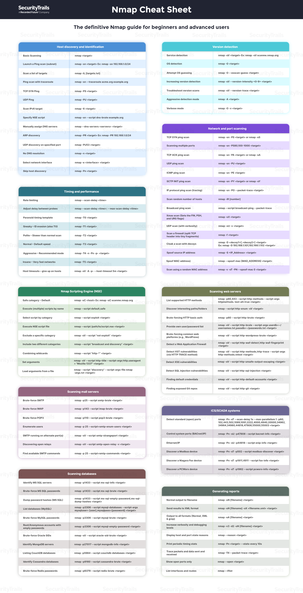

# Varredura de rede

A varredura de rede é uma técnica utilizada em cibersegurança para identificar e mapear os dispositivos, sistemas e serviços em uma rede de computadores. É uma prática comum realizada por profissionais de segurança cibernética para avaliar a postura de segurança de uma rede e identificar possíveis vulnerabilidades e ameaças.

A varredura de rede pode ser feita de forma automatizada por meio de ferramentas de varredura de rede, que enviam pacotes de dados para a rede e analisam as respostas recebidas para identificar dispositivos ativos, portas abertas, serviços em execução e outras informações relevantes sobre a topologia da rede. Essas ferramentas podem ajudar os profissionais de segurança a identificar possíveis pontos fracos na segurança da rede, como sistemas desatualizados, portas abertas desnecessárias ou configurações incorretas, que podem ser exploradas por potenciais atacantes.

A varredura de rede também pode ser feita de forma manual, utilizando técnicas mais avançadas e conhecimentos especializados para identificar vulnerabilidades específicas ou realizar testes de penetração (penetration testing) para avaliar a eficácia das medidas de segurança da rede contra ataques reais.

É importante notar que a varredura de rede deve ser realizada apenas em redes que o profissional de segurança cibernética tenha autorização para acessar e avaliar. É fundamental seguir as leis e regulamentações aplicáveis, bem como obter permissão por escrito dos proprietários dos sistemas antes de realizar qualquer tipo de varredura de rede. A ética e a legalidade são princípios fundamentais na prática da cibersegurança.

## NMAP

Nmap é uma ferramenta de segurança de rede usada para explorar e mapear redes de computadores. O nome Nmap significa "Network Mapper" (Mapeador de Rede, em português) e é amplamente utilizado por administradores de rede, analistas de segurança e hackers éticos para avaliar a segurança das redes.

O Nmap funciona enviando pacotes de rede para um ou mais endereços IP ou hosts em uma rede, e analisando as respostas recebidas para determinar quais portas estão abertas e quais serviços estão em execução em cada host. A ferramenta pode ser usada para descobrir sistemas vulneráveis em uma rede, identificar configurações inadequadas de segurança e detectar malware ou outras ameaças.

O Nmap é geralmente usado na linha de comando, com opções de linha de comando que permitem personalizar a varredura e a saída dos resultados. Existem também várias interfaces gráficas de usuário (GUIs) disponíveis para o Nmap, que tornam a ferramenta mais fácil de usar para usuários menos experientes.

Alguns exemplos de aplicativos, serviços e equipamentos que usam o Nmap incluem:

- Testes de penetração: O Nmap é frequentemente usado em testes de penetração (pentests) para avaliar a segurança da rede e identificar pontos fracos que possam ser explorados por hackers mal-intencionados.
- Gerenciamento de rede: O Nmap pode ser usado por administradores de rede para identificar dispositivos de rede, verificar se os serviços estão em execução e monitorar o tráfego de rede.
- Análise de vulnerabilidades: Ferramentas de análise de vulnerabilidades, como o **OpenVAS** e o **Nessus**, usam o Nmap para identificar sistemas vulneráveis em uma rede.
- Segurança de rede: O Nmap é frequentemente usado em conjunto com outras ferramentas de segurança de rede, como firewalls e sistemas de detecção de intrusão (IDS), para avaliar a segurança da rede e identificar possíveis ameaças.

## Técnicas

O Nmap (Network Mapper) é uma ferramenta popular de código aberto usada para varredura de rede, e pode ser utilizado tanto para fins legítimos, como para fins maliciosos por indivíduos com intenções de ataque cibernético. Algumas das técnicas de ataque que podem ser realizadas usando o Nmap incluem:

- Varredura de portas: O Nmap pode ser usado para varrer uma rede em busca de portas abertas em sistemas alvo. Isso pode ajudar um atacante a identificar quais serviços ou aplicativos estão sendo executados em um sistema, e possivelmente identificar vulnerabilidades conhecidas associadas a esses serviços.
- Detecção de sistemas operacionais: O Nmap pode ser usado para identificar o sistema operacional em execução em um host alvo com base nas características de suas respostas de rede. Isso pode ser útil para um atacante determinar quais vulnerabilidades específicas podem ser exploradas em um sistema operacional específico.
- Varredura de scripts e plugins: O Nmap suporta a execução de scripts e plugins personalizados, o que permite aos atacantes escreverem e executarem scripts de ataque personalizados para explorar vulnerabilidades específicas ou realizar atividades maliciosas em um host alvo.
- Varredura de rede furtiva: O Nmap suporta opções de varredura que podem tentar evadir a detecção de sistemas de segurança, como firewalls e sistemas de detecção de intrusões (IDS). Por exemplo, a varredura "Stealth" do Nmap pode tentar evitar a detecção escondendo o tráfego de varredura em pacotes legítimos.
- Varredura de DNS: O Nmap também pode ser usado para varrer e explorar servidores de nomes de domínio (DNS), buscando informações sobre os registros de DNS de um domínio específico, como identificação de hosts, serviços e configurações de DNS.

É importante ressaltar que o uso do Nmap ou de qualquer outra ferramenta de varredura de rede para fins de ataque cibernético é ilegal e antiético. Apenas profissionais de segurança cibernética autorizados devem usar o Nmap ou qualquer outra ferramenta de varredura de rede para fins legítimos, como avaliação de segurança em ambientes controlados e com devida autorização legal. O uso inadequado do Nmap ou de qualquer outra ferramenta de segurança pode resultar em consequências legais graves.