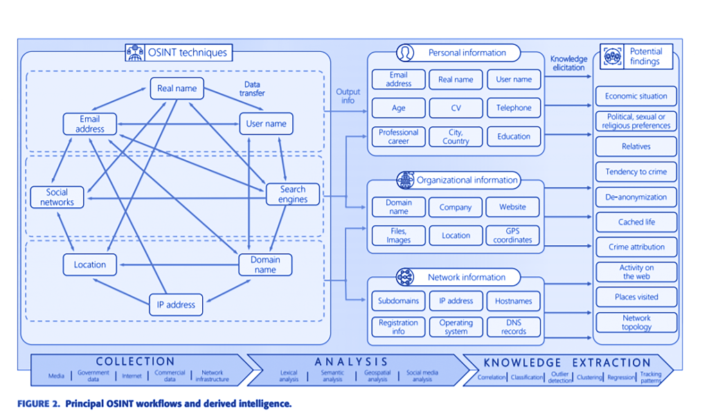
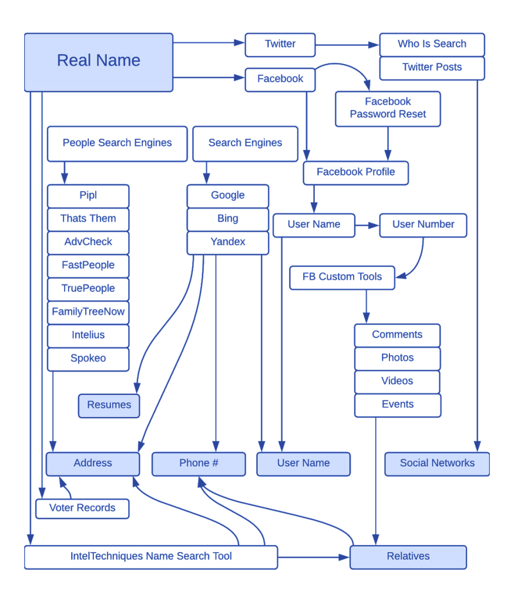

# OSINT

OSINT significa "Open Source Intelligence" (Inteligência de Fontes Abertas, em português) e se refere à coleta, análise e interpretação de informações que estão disponíveis publicamente, geralmente na Internet. Essas informações podem incluir dados de redes sociais, fóruns online, sites de notícias, informações de registros públicos, entre outros.

O objetivo do OSINT é reunir informações úteis e relevantes para tomar decisões informadas. Isso pode ser feito por indivíduos, empresas ou organizações governamentais para diversos fins, como investigação de fraudes, análise de ameaças à segurança, pesquisa de mercado, entre outros.

O OSINT é feito através de técnicas e ferramentas de coleta e análise de dados. Algumas das técnicas mais comuns incluem a busca em mecanismos de pesquisa, a análise de redes sociais, a mineração de dados e a análise de sentimentos. Existem também muitas ferramentas disponíveis para auxiliar na coleta e análise de informações, como o **Maltego**, o **OSINT Framework**, o **Social-Engineer Toolkit**, entre outros.

Alguns exemplos de aplicativos, serviços e equipamentos que utilizam OSINT incluem:

- Investigação de antecedentes criminais: Existem empresas que oferecem serviços de investigação de antecedentes criminais usando técnicas de OSINT. Essas empresas coletam informações de registros públicos, bancos de dados governamentais e outras fontes de informação disponíveis publicamente.
- Análise de risco cibernético: Empresas de segurança cibernética utilizam técnicas de OSINT para coletar informações sobre ameaças e vulnerabilidades cibernéticas, bem como para monitorar atividades suspeitas na rede.
- Análise de mídias sociais: Ferramentas como Hootsuite Insights, Brandwatch e Sprout Social são usadas para monitorar e analisar atividades nas mídias sociais, como sentimentos do usuário, tendências e engajamento do público.
- Análise de mercado: Empresas usam técnicas de OSINT para coletar informações sobre a concorrência, tendências de mercado, novos produtos e demanda do consumidor.

## OSINT Framework

O OSINT Framework é uma coleção abrangente de recursos e ferramentas de código aberto para a realização de inteligência de fonte aberta (OSINT, do inglês Open Source Intelligence). Ele fornece uma ampla gama de recursos gratuitos e de código aberto que podem ser utilizados para coletar informações de fontes abertas na internet, como redes sociais, motores de busca, bancos de dados públicos, fóruns, websites e muito mais.

O OSINT Framework é uma ferramenta útil para pesquisadores, investigadores, profissionais de segurança cibernética, analistas de inteligência e qualquer pessoa envolvida na coleta e análise de informações de fontes abertas. Ele é composto por uma coleção organizada de categorias e subcategorias de recursos, que incluem ferramentas, técnicas e métodos de coleta de informações de várias fontes abertas.

As categorias do OSINT Framework abrangem uma ampla gama de áreas, como pessoas, empresas, organizações, redes sociais, email, domínios, IPs, localização geográfica, código-fonte, eventos, notícias, e muitos outros. Cada categoria possui uma lista de recursos e ferramentas de código aberto relacionadas, com links para os respectivos websites e documentações.

O OSINT Framework é uma fonte valiosa de informações e ferramentas para realizar investigações, pesquisas e análises de inteligência com base em fontes abertas. É importante observar que o uso do OSINT deve ser realizado em conformidade com as leis e regulamentos aplicáveis, incluindo os princípios éticos de coleta e uso de informações.

## Shodan

O Shodan é um motor de busca especializado em busca de dispositivos conectados à Internet, como servidores, roteadores, câmeras IP, e outros dispositivos IoT (Internet of Things). Ao contrário dos motores de busca convencionais que indexam páginas web, o Shodan indexa informações sobre os dispositivos e serviços expostos na Internet, permitindo aos usuários buscar por dispositivos com base em critérios específicos, como localização geográfica, tipo de dispositivo, porta de rede, e até mesmo por palavras-chave relacionadas aos serviços em execução.

Aqui está um tutorial básico de como usar o Shodan:

- Acesse o site do Shodan em https://www.shodan.io/ e crie uma conta gratuita, se você ainda não tiver uma.
- Faça login na sua conta do Shodan.
- No campo de pesquisa na página inicial do Shodan, você pode inserir palavras-chave relacionadas aos dispositivos ou serviços que deseja encontrar. Por exemplo, você pode digitar "Apache" para encontrar servidores web Apache expostos na Internet.
- Use os filtros avançados para refinar sua pesquisa. Você pode especificar a localização geográfica, o tipo de dispositivo, o sistema operacional, a porta de rede e muitos outros critérios para encontrar dispositivos específicos.
- Analise os resultados da pesquisa para encontrar informações detalhadas sobre os dispositivos encontrados, como endereço IP, localização geográfica, banners de serviço, e outras informações relevantes.
- Utilize as informações encontradas de forma ética e legal, sempre respeitando as leis de privacidade e segurança. O Shodan pode ser uma ferramenta poderosa para fins de pesquisa, identificação de vulnerabilidades e teste de segurança em dispositivos, mas também pode ser utilizada de maneira inadequada para fins maliciosos. Portanto, use-o com responsabilidade e ética.

Lembre-se de que o Shodan é uma ferramenta de busca de dispositivos conectados à Internet e, assim como outras ferramentas de segurança, deve ser utilizada com cuidado e respeitando a legislação local e as políticas de privacidade. Certifique-se sempre de obter autorização adequada antes de realizar qualquer teste de segurança em dispositivos de terceiros e tome medidas adequadas para proteger sua própria privacidade e segurança online.

## Maltego

O Maltego é uma ferramenta de inteligência de código aberto (open source) usada para coletar e correlacionar informações sobre alvos ou entidades específicas na Internet. É uma ferramenta poderosa para análise de informações de código aberto (OSINT - Open Source Intelligence) e pode ser usada para realizar investigações, análises de vulnerabilidades, análises de ameaças, reconhecimento de alvo e outras atividades relacionadas à inteligência de segurança.

Aqui estão algumas informações básicas sobre o Maltego e como utilizá-lo:

- Baixe e instale o Maltego em seu computador. O Maltego está disponível em várias edições, incluindo uma versão gratuita chamada Maltego CE (Community Edition), que possui recursos limitados, e versões comerciais com recursos avançados.
- Abra o Maltego e selecione o tipo de entidade que você deseja investigar. O Maltego suporta uma ampla variedade de entidades, como endereços de e-mail, nomes de domínio, endereços IP, perfis de redes sociais, números de telefone, e muitos outros.
- Conecte-se a várias fontes de dados públicas e comerciais disponíveis no Maltego, como mecanismos de busca, redes sociais, serviços de DNS, bases de dados de registros públicos, entre outros. O Maltego usa transformações (Transforms) para consultar e coletar informações dessas fontes de dados, que podem ser representadas graficamente em um diagrama.
- Analise os resultados e visualize as informações coletadas em formato gráfico. O Maltego permite visualizar as informações coletadas em um diagrama interativo que pode ser personalizado de acordo com suas necessidades. Você pode explorar relacionamentos entre entidades, identificar padrões, e obter insights valiosos para suas investigações.
- Utilize as informações obtidas de forma ética e legal, sempre respeitando as leis de privacidade e segurança. O Maltego é uma ferramenta poderosa que pode ajudar na coleta e correlação de informações, mas é importante usá-la de forma responsável e ética, de acordo com as leis e regulamentos aplicáveis.

Lembre-se de que o Maltego é uma ferramenta de análise de informações de código aberto que pode ser usada para fins legais e éticos, como investigações de segurança, pesquisa de ameaças e análise de vulnerabilidades. No entanto, é importante sempre obter autorização adequada e cumprir todas as leis e regulamentos aplicáveis ao realizar qualquer atividade de coleta de informações ou análise de dados. Certifique-se também de proteger sua própria privacidade e segurança online durante o uso do Maltego ou qualquer outra ferramenta de segurança.

## Foca

O FOCA (Fingerprinting Organizations with Collected Archives) é uma ferramenta de código aberto desenvolvida pela empresa espanhola Informática 64 que é usada para coletar e analisar metadados em documentos para obter informações sobre organizações ou entidades específicas. O FOCA é amplamente utilizado para análise de segurança e testes de penetração, e é uma ferramenta popular na comunidade de segurança da informação.

Aqui estão algumas informações básicas sobre o FOCA e como utilizá-lo:

- Baixe e instale o FOCA em seu computador. O FOCA é uma ferramenta para Windows e está disponível gratuitamente no site oficial da Informática 64.
- Abra o FOCA e conecte-se a um alvo específico. O FOCA permite a você especificar um domínio ou uma URL como alvo para análise.
- Analise os documentos coletados em busca de metadados. O FOCA é capaz de analisar documentos, como arquivos PDF, documentos do Microsoft Office (Word, Excel, PowerPoint) e outros formatos, em busca de metadados incorporados, como nome do autor, nome da organização, endereços de e-mail, nomes de arquivos e muito mais.
- Extraia metadados e obtenha insights sobre a organização alvo. O FOCA permite extrair os metadados encontrados nos documentos analisados e apresentá-los em uma interface gráfica fácil de usar. Isso pode fornecer informações valiosas sobre a organização, sua estrutura, funcionários, tecnologias usadas e outras informações relevantes para análise de segurança.
- Utilize as informações obtidas de forma ética e legal, sempre respeitando as leis de privacidade e segurança. O FOCA é uma ferramenta poderosa que pode ajudar na coleta de informações, mas é importante usá-la de forma responsável e ética, de acordo com as leis e regulamentos aplicáveis.

Lembre-se de que o FOCA é uma ferramenta de análise de metadados de documentos que pode ser usada para fins legais e éticos, como análise de segurança, pesquisa de informações públicas e análise de vulnerabilidades. No entanto, é importante sempre obter autorização adequada e cumprir todas as leis e regulamentos aplicáveis ao realizar qualquer atividade de coleta de informações ou análise de dados. Certifique-se também de proteger sua própria privacidade e segurança online durante o uso do FOCA ou qualquer outra ferramenta de segurança.