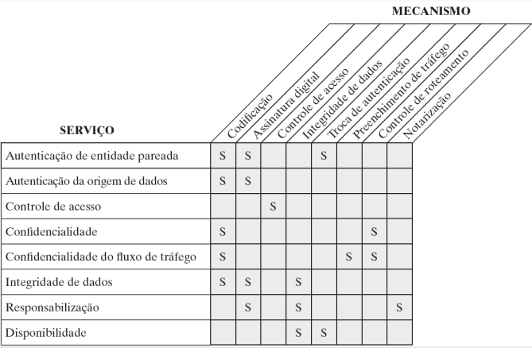
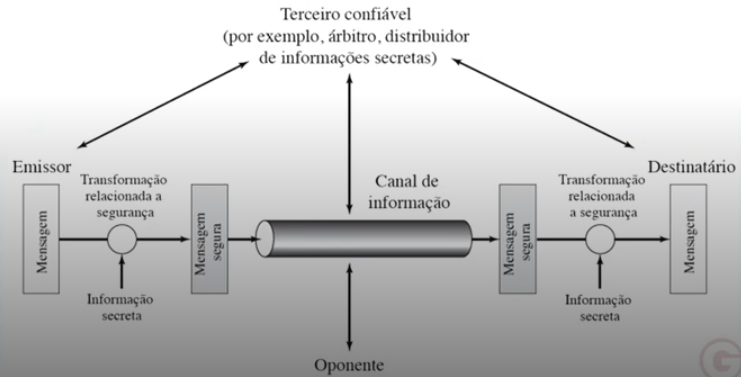

# Segurança da informação

## Órgãos responsáveis pela elaboração de padrões

- National Institute of Standads and Technology (NIST)
- Internet Society (ISOC)
- The International Telecommunication Union (ITU)
- International Organization for Standardization (ISO)

## Níveis de impacto

Os níveis de impacto de segurança são uma abordagem usada para avaliar a gravidade dos efeitos potenciais de uma violação de segurança da informação. Esses níveis são geralmente usados para classificar a gravidade dos riscos ou ameaças associados à confidencialidade, integridade e disponibilidade das informações. Os três níveis de impacto de segurança comuns são:

- Baixo impacto: Um incidente de baixo impacto geralmente tem um efeito limitado nas operações e nos ativos de informação de uma organização. Pode envolver a exposição de informações de baixa sensibilidade, com um impacto mínimo na confidencialidade, integridade ou disponibilidade dessas informações. Pode ser uma violação de segurança isolada que é corrigida facilmente sem causar grandes danos ou interrupções significativas nos negócios ou serviços.
- Moderado impacto: Um incidente de moderado impacto pode ter um efeito mais significativo nas operações e nos ativos de informação de uma organização. Pode envolver a exposição de informações sensíveis, com potencial para afetar a confidencialidade, integridade ou disponibilidade dessas informações em maior escala. Pode requerer uma resposta mais extensa e ações corretivas mais significativas para mitigar os efeitos e restaurar a segurança das informações afetadas.
- Alto impacto: Um incidente de alto impacto é considerado grave e pode ter consequências significativas para as operações e ativos de informação de uma organização. Pode envolver a exposição de informações altamente sensíveis, com um impacto grave na confidencialidade, integridade ou disponibilidade dessas informações. Pode resultar em interrupções significativas nos negócios, danos financeiros, danos à reputação e/ou consequências legais ou regulatórias graves. A resposta a um incidente de alto impacto pode exigir uma ação imediata e abrangente para conter os danos e restaurar a segurança das informações afetadas.

A avaliação do nível de impacto de segurança é importante para priorizar ações de resposta a incidentes, alocar recursos adequados, estabelecer políticas de segurança apropriadas e tomar decisões informadas em relação à gestão de riscos de segurança da informação. É importante que as organizações estabeleçam critérios claros e consistentes para avaliar o impacto de segurança de forma apropriada de acordo com suas necessidades e requisitos específicos.

## Arquitetura de segurança

No contexto de arquitetura de segurança da informação, os termos "ataque", "mecanismo" e "serviço" são usados da seguinte forma:

- Ataque: Um ataque é uma ação intencional realizada por uma parte mal-intencionada para violar a confidencialidade, integridade ou disponibilidade de informações ou sistemas de informação. Os ataques podem ser de diversas naturezas, como tentativas de acesso não autorizado, exploração de vulnerabilidades de segurança, interceptação de dados, destruição de dados, entre outros. Os ataques podem ser perpetrados por hackers, crackers, malware, insiders mal-intencionados ou outras ameaças.
- Mecanismo: Um mecanismo é uma técnica, método ou procedimento utilizado para implementar a segurança em sistemas de informação. Os mecanismos são projetados para proteger as informações e os sistemas contra ataques e outras ameaças à segurança. Exemplos de mecanismos de segurança incluem autenticação (como senhas, tokens, biometria), criptografia (para proteção de dados em trânsito e em repouso), firewalls (para proteção de redes), detecção de intrusão (para identificação de atividades suspeitas), políticas de segurança (para definir diretrizes e restrições de uso), entre outros.
- Serviço: Um serviço de segurança da informação é uma funcionalidade ou recurso que é fornecido para proteger as informações e sistemas de uma organização. Os serviços de segurança da informação são projetados para garantir a confidencialidade, integridade, disponibilidade e outras características de segurança das informações. Exemplos de serviços de segurança da informação incluem gerenciamento de identidade e acesso, gestão de chaves criptográficas, monitoramento de segurança, resposta a incidentes de segurança, auditoria de segurança, entre outros.

Em resumo, no contexto de arquitetura de segurança da informação, um ataque é uma ação mal-intencionada, um mecanismo é uma técnica ou método utilizado para implementar a segurança e um serviço é uma funcionalidade ou recurso que é fornecido para proteger as informações e sistemas de uma organização. Todos esses elementos são importantes para garantir a proteção adequada das informações e a mitigação de riscos de segurança em um ambiente de segurança da informação.

### Ataques

No contexto da segurança da informação, os ataques podem ser classificados em ataque passivo e ataque ativo. Vamos explorar as definições desses conceitos:

- Ataque Passivo: Um ataque passivo é uma tentativa de acesso não autorizado ou monitoramento de informações sem alterar seu conteúdo. O objetivo principal de um ataque passivo é obter informações confidenciais sem que o detentor dessas informações saiba que elas foram acessadas. Exemplos de ataques passivos incluem a interceptação de dados em uma rede, a análise de tráfego de rede para identificar padrões de uso ou a escuta de comunicações sem fio.
- Ataque Ativo: Um ataque ativo é uma tentativa de acesso não autorizado ou alteração de informações em um sistema ou rede. Diferentemente de um ataque passivo, um ataque ativo envolve a modificação ou destruição de informações, ou a realização de ações prejudiciais em um sistema ou rede. Exemplos de ataques ativos incluem a injeção de código malicioso em um site, a manipulação de dados em uma transação, a falsificação de pacotes de rede para enganar um sistema, ou a negação de serviço (DoS) para tornar um serviço ou recurso indisponível.

Esses conceitos de ataque passivo e ataque ativo são importantes para entender as diferentes maneiras pelas quais os sistemas e informações podem ser comprometidos. Os profissionais de segurança da informação precisam estar cientes desses tipos de ataques e implementar medidas adequadas para proteger suas informações e sistemas contra ambos os tipos de ameaças.

### Mecanismos

No contexto da segurança da informação, os mecanismos de segurança são as técnicas ou métodos utilizados para implementar a proteção de informações e sistemas. Aqui estão alguns exemplos de mecanismos de segurança:

- Autenticação: A autenticação é o processo de verificar a identidade de um usuário, dispositivo ou sistema antes de conceder acesso a informações ou recursos protegidos. Exemplos de mecanismos de autenticação incluem senhas, tokens de segurança, certificados digitais, biometria, entre outros.
- Criptografia: A criptografia é o processo de codificação de informações para proteger sua confidencialidade e integridade. Ela pode ser utilizada para proteger dados em trânsito (como durante a transmissão pela internet) ou dados em repouso (como armazenados em dispositivos de armazenamento). Exemplos de mecanismos de criptografia incluem algoritmos de criptografia simétrica e assimétrica, certificados digitais, chaves de criptografia, entre outros.
- Firewalls: Firewalls são dispositivos ou software que controlam o tráfego de rede entre redes distintas, como a rede interna de uma organização e a internet. Eles podem filtrar o tráfego de rede com base em regras predefinidas, permitindo apenas o tráfego autorizado e bloqueando o tráfego não autorizado. Firewalls podem ser implementados em nível de rede, host ou aplicação.
- Detecção de Intrusão: A detecção de intrusão é o processo de identificar atividades suspeitas ou maliciosas em um sistema ou rede. Isso pode ser feito através de mecanismos de software ou hardware que monitoram o tráfego de rede, registros de eventos ou comportamento de sistema em busca de indicadores de comprometimento ou atividades anormais.
- Políticas de Segurança: As políticas de segurança são diretrizes e restrições definidas por uma organização para garantir o uso seguro de informações e sistemas. Elas podem incluir políticas de senha, políticas de acesso, políticas de uso aceitável, entre outras, e são projetadas para estabelecer práticas de segurança consistentes e mitigar riscos.

Esses são apenas alguns exemplos de mecanismos de segurança utilizados na proteção de informações e sistemas em um ambiente de segurança da informação. É importante entender os diferentes mecanismos disponíveis e como eles podem ser implementados de forma apropriada para atender aos objetivos de segurança da organização.

### serviços

No contexto da segurança da informação, os serviços de segurança são os recursos ou funcionalidades que são oferecidos para proteger informações e sistemas. Aqui estão alguns exemplos de serviços de segurança:

- Monitoramento de Segurança: O monitoramento de segurança envolve o uso de ferramentas e tecnologias para monitorar continuamente a atividade de sistemas e redes em busca de possíveis ameaças ou atividades maliciosas. Isso pode incluir a análise de registros de eventos, o monitoramento de tráfego de rede, a detecção de intrusões, a análise de comportamento de usuário, entre outros.
- Resposta a Incidentes: A resposta a incidentes é o processo de identificação, triagem e resposta a eventos de segurança detectados. Isso pode incluir a investigação de incidentes de segurança, a contenção de ameaças, a recuperação de sistemas comprometidos e a restauração de serviços afetados.
- Testes de Segurança: Os testes de segurança são realizados para avaliar a resistência de sistemas e redes a ameaças de segurança. Isso pode incluir testes de penetração, que são tentativas controladas de explorar vulnerabilidades em sistemas e redes para identificar falhas de segurança, e testes de vulnerabilidade, que são varreduras automatizadas ou avaliações de sistemas em busca de vulnerabilidades conhecidas.
- Gestão de Identidade e Acesso: A gestão de identidade e acesso envolve a administração de credenciais de usuários, controle de acesso a sistemas e recursos, e a implementação de políticas de acesso com base em funções e permissões de usuário. Isso pode incluir a criação, modificação e revogação de contas de usuário, autenticação multifator, Single Sign-On (SSO), e a implementação de controles de acesso granulares.
- Educação e Conscientização em Segurança: A educação e conscientização em segurança são serviços que visam educar os usuários e funcionários sobre práticas seguras de uso de sistemas e informações. Isso pode incluir treinamentos, workshops, campanhas de conscientização, e a disseminação de políticas e procedimentos de segurança para garantir que os usuários estejam cientes das melhores práticas de segurança e saibam como agir de forma segura em seu ambiente de trabalho.

Esses são apenas alguns exemplos de serviços de segurança que são oferecidos para proteger informações e sistemas em um ambiente de segurança da informação. É importante contar com uma combinação adequada de serviços de segurança para garantir uma proteção abrangente e eficaz contra ameaças de segurança.

### Serviço x Mecanismo

## Modelo de comunicação

- Emissor: É a parte que inicia o processo de comunicação, enviando a mensagem. O emissor é responsável por codificar a mensagem em um formato compreensível e enviá-la ao receptor.
- Receptor: É a parte que recebe a mensagem enviada pelo emissor e decodifica para obter seu significado. O receptor é responsável por interpretar a mensagem e compreendê-la.
- Canal: É o meio de transmissão utilizado para enviar a mensagem do emissor ao receptor. Pode ser um meio físico, como um cabo de rede, ou um meio sem fio, como o ar para comunicações sem fio.
- Criptografia: É o processo de codificar a mensagem de forma a torná-la ilegível para terceiros não autorizados. A criptografia é frequentemente usada para garantir a confidencialidade da mensagem, protegendo seu conteúdo contra interceptação ou acesso não autorizado.
- Árbitro: É uma entidade imparcial que atua como intermediário no processo de comunicação, garantindo a integridade e autenticidade da mensagem. O árbitro pode verificar a autenticidade dos envolvidos na comunicação, validar a integridade da mensagem e garantir a conformidade com as políticas de segurança estabelecidas.
- Oponente: É uma entidade mal-intencionada ou adversária que pode tentar interromper, interceptar, modificar ou acessar indevidamente a mensagem ou o processo de comunicação. O oponente pode ser uma pessoa, uma organização ou até mesmo um software malicioso.

Nesse modelo geral de comunicação, o emissor envia a mensagem através do canal para o receptor, enquanto a criptografia é utilizada para proteger o conteúdo da mensagem contra interceptação. O árbitro atua como um intermediário confiável para garantir a integridade e autenticidade da comunicação, enquanto o oponente pode representar uma ameaça à segurança da comunicação, tentando interferir ou obter acesso não autorizado à mensagem.

## Review

- 1.1 o que é a arquitetura de segurança oSI?
- 1.2 Qual é a diferença entre ameaças à segurança passivas e ativas?
- 1.3 liste e defina resumidamente as categorias de ataques passivos e ativos à segurança.
- 1.4 liste e defina resumidamente as categorias dos serviços de segurança.
- 1.5 liste e defina resumidamente as categorias dos mecanismos de segurança.

1.1 A arquitetura de segurança OSI (Open Systems Interconnection) é um modelo de referência utilizado para descrever a estrutura de comunicação em redes de computadores. Ela é composta por sete camadas, cada uma responsável por uma parte específica do processo de comunicação, desde a camada física até a camada de aplicação. A arquitetura OSI é uma estrutura conceitual que permite a comunicação entre diferentes sistemas e define padrões para a interoperabilidade de redes.

1.2 A diferença entre ameaças à segurança passivas e ativas está relacionada com o tipo de ação que é realizada pelo atacante. Ameaças passivas são aquelas em que o atacante busca obter informações ou monitorar as atividades do sistema sem realizar ações diretas para modificar ou interromper a operação normal do sistema. Por outro lado, ameaças ativas são aquelas em que o atacante realiza ações diretas para modificar, corromper, destruir ou interromper a operação normal do sistema.

1.3 Categorias de ataques

Ataques passivos à segurança:

- Monitoramento: o atacante monitora a comunicação ou as atividades do sistema para obter informações sensíveis.
- Interceptação: o atacante obtém acesso não autorizado a informações em trânsito entre os sistemas, como interceptar pacotes de rede.
- Escuta clandestina: o atacante utiliza dispositivos para obter informações confidenciais, como escutas telefônicas ou keyloggers.

Ataques ativos à segurança:

- Modificação: o atacante realiza alterações não autorizadas nas informações ou dados do sistema.
- Interrupção: o atacante busca interromper ou inutilizar o funcionamento normal do sistema ou dos serviços.
- Corrupção: o atacante danifica ou corrompe os dados ou recursos do sistema.

1.4 Categorias de serviços de segurança:

- Confidencialidade: garante que as informações sejam protegidas contra acesso não autorizado, garantindo que somente as partes autorizadas possam acessá-las.
- Integridade: garante a integridade das informações, protegendo-as contra alterações ou corrupção não autorizada.
- Autenticação: verifica a identidade das partes envolvidas na comunicação, garantindo que sejam quem afirmam ser.
- Autorização: gerencia as permissões e acessos dos usuários aos recursos e serviços do sistema.
- Disponibilidade: garante a disponibilidade dos recursos e serviços do sistema, evitando interrupções não autorizadas.
- Não repúdio: garante que as partes envolvidas na comunicação não possam negar a autoria ou recebimento de uma mensagem.

1.5 Categorias de mecanismos de segurança:

- Controle de acesso: define políticas e mecanismos que regulam o acesso aos recursos do sistema, garantindo que somente usuários autorizados possam acessá-los.
- Criptografia: utiliza técnicas de codificação para proteger as informações contra acesso não autorizado, garantindo a confidencialidade e integridade dos dados.
- Assinatura digital: utiliza técnicas de criptografia para garantir a autenticidade e integridade das informações, permitindo a verificação da autoria da mensagem.
- Firewall: é uma barreira de segurança que monitora e controla
