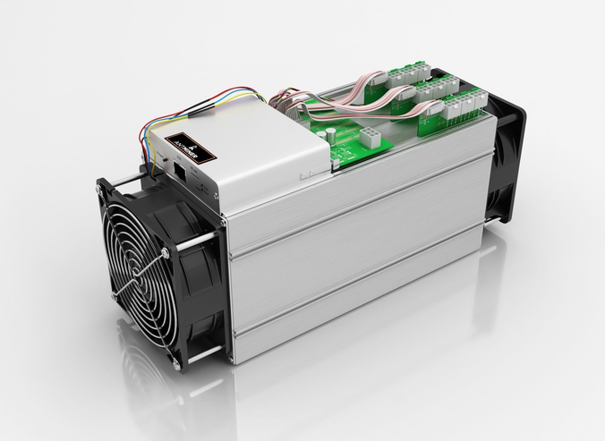
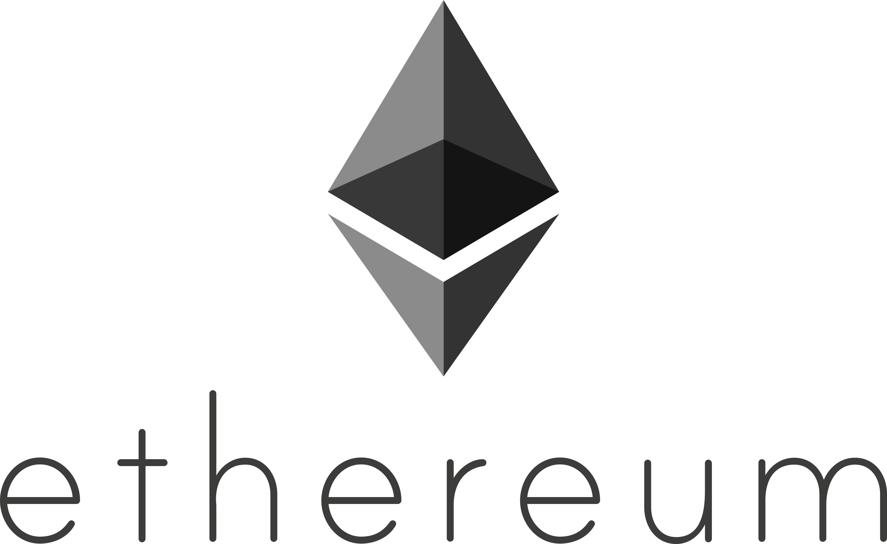

# Blockchain

A blockchain é uma tecnologia de contabilidade distribuída que é essencialmente um banco de dados descentralizado e seguro. Em vez de ser armazenada em um único local ou servidor, a blockchain é armazenada em uma rede descentralizada de computadores, conhecidos como "nós". Cada nó na rede tem uma cópia completa e idêntica da blockchain, o que significa que não há um ponto central de falha e a rede é altamente resistente a ataques maliciosos.

A blockchain é composta por blocos que contêm informações sobre transações, como o remetente, o destinatário, o valor e a data e hora da transação. Cada bloco contém um hash, que é uma sequência única de caracteres que representa o bloco. O hash do bloco anterior também é incluído no novo bloco, criando assim uma cadeia de blocos interconectados, daí o nome "blockchain".

A blockchain é segura e imutável porque cada transação é validada e registrada por múltiplos nós na rede, e para adulterar um registro na blockchain, um invasor precisaria hackear uma maioria dos nós na rede simultaneamente, o que é virtualmente impossível.

Você não precisa instalar a blockchain em seu computador para usar a tecnologia. A maioria das blockchains é acessível por meio de aplicativos ou carteiras que podem ser instalados em seu computador ou smartphone. Esses aplicativos permitem que você interaja com a blockchain, enviar e receber criptomoedas, criar contratos inteligentes e muito mais.

## Principais Blockchains

- Bitcoin: a primeira e mais famosa blockchain, usada principalmente como uma forma de pagamento descentralizada.
- Ethereum: A blockchain Ethereum é uma plataforma descentralizada e pública de computação distribuída, que permite a criação de aplicativos descentralizados (dApps) e a execução de contratos inteligentes.
- Binance Smart Chain (BSC): uma blockchain criada pela exchange Binance para permitir a criação de aplicativos descentralizados e contratos inteligentes com taxas de transação mais baixas que a Ethereum.
- Polkadot: uma blockchain projetada para conectar diferentes blockchains, permitindo a troca de dados e ativos entre elas.
- Cardano: uma blockchain projetada para oferecer segurança e escalabilidade, permitindo a execução de contratos inteligentes e a criação de aplicativos descentralizados.
- Solana: uma blockchain de alto desempenho que permite a execução de contratos inteligentes e aplicativos descentralizados em velocidades mais rápidas e com taxas de transação mais baixas que a Ethereum.

------

## Bitcoin

    

A blockchain do Bitcoin é uma rede descentralizada de computadores que permite a criação de um sistema financeiro digital totalmente descentralizado e seguro. Ela foi criada em 2009 como a primeira implementação da tecnologia blockchain e tem sido a criptomoeda mais popular e amplamente adotada desde então.

A blockchain do Bitcoin é composta por blocos que contêm informações sobre as transações na rede, como o remetente, o destinatário, o valor e a data e hora da transação. Cada bloco contém um hash, que é uma sequência única de caracteres que representa o bloco, e o hash do bloco anterior, criando assim uma cadeia de blocos interconectados, daí o nome "blockchain".

Os usuários podem enviar e receber bitcoins por meio da rede Bitcoin, que é altamente segura e imutável devido à natureza descentralizada da blockchain. Para adulterar um registro na blockchain, um invasor precisaria hackear uma maioria dos nós na rede simultaneamente, o que é virtualmente impossível.

Além disso, o Bitcoin é projetado para ser deflacionário, com um limite máximo de 21 milhões de bitcoins que podem ser minerados. A mineração de bitcoins é um processo pelo qual os computadores na rede resolvem problemas matemáticos complexos para validar transações e adicionar novos blocos à blockchain, recebendo bitcoins como recompensa.

Em resumo, a blockchain do Bitcoin é uma rede segura e descentralizada que permite a criação de um sistema financeiro digital seguro e descentralizado. Ela usa um sistema de mineração para validar transações e adicionar novos blocos à cadeia, e é projetada para ser deflacionária com um limite máximo de 21 milhões de bitcoins.

### Mineração

Minerar bitcoin envolve o uso de um hardware de mineração especializado, como ASICs (Application-Specific Integrated Circuits), para resolver problemas matemáticos complexos que validam transações na rede Bitcoin e adicionam novos blocos à blockchain. A mineração é uma atividade competitiva, e os mineradores competem para serem os primeiros a resolver o problema matemático e, assim, receber uma recompensa em bitcoin.

Atualmente, a mineração de bitcoin é muito mais difícil e complexa do que nos primeiros anos do Bitcoin, pois a competição por recompensas em bloco é muito alta, e a maioria dos mineradores agora opera em grandes instalações de mineração que consomem grandes quantidades de energia elétrica. Portanto, a mineração de bitcoin não é algo que possa ser facilmente feito em casa com um computador comum.

Além disso, a rentabilidade da mineração de bitcoin depende de vários fatores, como o custo da eletricidade, o preço atual do bitcoin e o custo do hardware de mineração. Embora a mineração possa ser lucrativa em algumas circunstâncias, é importante lembrar que há muitos riscos envolvidos, e o retorno sobre o investimento pode variar amplamente.

#### How to Mine

- Obtenha um hardware de mineração de bitcoin: Você precisará de um hardware de mineração de bitcoin especializado, como ASICs (Application-Specific Integrated Circuits). Estes são projetados especificamente para a mineração de bitcoin e são muito mais eficientes do que um computador comum.

    

- Configure seu hardware de mineração: Siga as instruções fornecidas pelo fabricante do seu hardware de mineração para configurá-lo corretamente. Isso geralmente envolve conectar o hardware a uma fonte de alimentação e a um computador ou dispositivo de mineração.
- Escolha uma pool de mineração: A mineração de bitcoin é uma atividade competitiva e é mais provável que você tenha sucesso se se juntar a uma pool de mineração. As pools de mineração são grupos de mineradores que se unem para combinar seu poder de processamento e aumentar suas chances de ganhar recompensas em bloco.
- Instale um software de mineração: Para conectar seu hardware de mineração à pool de mineração, você precisará de um software de mineração. Existem várias opções disponíveis, incluindo CGMiner, BFGMiner e EasyMiner.
- Comece a minerar: Depois de instalar o software de mineração, você pode começar a minerar bitcoin. O software de mineração enviará problemas matemáticos para o seu hardware de mineração, e você receberá uma recompensa em bitcoin se resolver com sucesso um problema matemático e validar um bloco na blockchain do Bitcoin.

------

## Ethereum

    

A blockchain Ethereum é uma plataforma descentralizada e pública de computação distribuída, que permite a criação de aplicativos descentralizados (dApps) e a execução de contratos inteligentes. A Ethereum utiliza sua própria criptomoeda, o Ether (ETH), como meio de troca na plataforma.

A principal diferença entre a blockchain Ethereum e a blockchain do Bitcoin é que a Ethereum permite a criação de contratos inteligentes, que são programas autônomos que executam automaticamente as regras acordadas entre as partes envolvidas em uma transação. Isso significa que a plataforma Ethereum pode ser usada para criar aplicativos descentralizados, como jogos, mercados de previsão, sistemas de identidade digital e muito mais.

A blockchain Ethereum é baseada em uma tecnologia de contabilidade distribuída, em que todas as transações são registradas em uma rede descentralizada de computadores, conhecidos como "nós". Esses nós validam as transações e garantem a integridade e a segurança da rede. A Ethereum também utiliza um algoritmo de consenso chamado Proof of Work (PoW), que garante que apenas as transações válidas sejam adicionadas à blockchain.

### Ethereum x Bitcoin

O Ethereum é uma das maiores e mais populares blockchains, especialmente por permitir a criação de contratos inteligentes e tokens personalizados, incluindo os NFTs. No entanto, em termos de capitalização de mercado, o Bitcoin é atualmente a maior criptomoeda e blockchain do mundo.

O Bitcoin e o Ethereum são duas blockchains diferentes e independentes. Embora ambas as blockchains permitam transações seguras e descentralizadas, elas têm finalidades e tecnologias diferentes. O Bitcoin foi criado principalmente para permitir transações financeiras peer-to-peer, enquanto o Ethereum foi criado para permitir a criação de aplicativos descentralizados.

------

## Tipos de Node em uma blockchain

- Full nodes: Os full nodes armazenam e mantêm uma cópia completa do ledger da blockchain. Eles validam transações e blocos e ajudam a manter a integridade da rede.
- Masternodes: Os masternodes são nodes especiais em algumas blockchains que têm funções adicionais, como processar transações privadas ou governar a rede. Eles normalmente requerem um grande investimento para operar e são recompensados ​​com uma parte das taxas de transação.
- Light nodes: Os light nodes são nodes que não armazenam uma cópia completa do ledger da blockchain. Em vez disso, eles dependem de full nodes para obter informações sobre a blockchain. Isso os torna mais leves e mais fáceis de executar em dispositivos móveis e outros dispositivos com recursos limitados.
- Mining nodes: Os mining nodes são nodes que executam o software de mineração de criptomoedas e ajudam a processar transações e validar blocos. Eles requerem um hardware especializado e muito poder de processamento.
- Nodes de validação: Em algumas blockchains, existem nodes específicos que são responsáveis ​​por validar transações e blocos antes que sejam adicionados ao ledger da blockchain. Esses nodes são geralmente selecionados com base em seu histórico de confiabilidade e segurança.

## Trilema da blockchain

O trilema da blockchain é uma teoria que afirma que é impossível para uma blockchain ter simultaneamente três características: segurança, escalabilidade e descentralização. A teoria sugere que uma blockchain só pode ter duas dessas características de cada vez.

A segurança se refere à resistência da blockchain a ataques maliciosos. A escalabilidade se refere à capacidade da blockchain de processar um grande número de transações simultaneamente. E a descentralização se refere à distribuição da rede da blockchain em diferentes nós, sem que um único nó tenha controle absoluto.

Por exemplo, se uma blockchain prioriza a segurança e a descentralização, ela pode ter dificuldades em escalar para processar um grande número de transações. Se a blockchain prioriza a escalabilidade e a segurança, pode precisar sacrificar a descentralização. E se a blockchain prioriza a descentralização e a escalabilidade, pode colocar em risco a segurança da rede.

A maioria das blockchains atualmente existentes enfrentam o trilema de alguma forma. Por exemplo, o Bitcoin é conhecido por sua segurança e descentralização, mas tem dificuldades em escalar para atender a uma grande demanda de transações. Já a rede da Ethereum tem como objetivo ser escalável e descentralizada, mas pode enfrentar desafios de segurança.

Os desenvolvedores de blockchains estão constantemente trabalhando em soluções para lidar com o trilema, como o uso de tecnologias de consenso mais eficientes, aprimoramento de algoritmos de mineração e a implementação de soluções de escalabilidade.

## Smart Contract

Um smart contract (contrato inteligente) é um programa de computador que executa automaticamente os termos de um contrato acordado entre duas partes, sem a necessidade de um intermediário ou terceira parte de confiança.

Os smart contracts são baseados em tecnologia blockchain, que permite a criação de contratos digitais com confiança e segurança, garantindo que as regras acordadas serão cumpridas. Eles são escritos em uma linguagem de programação específica e são executados automaticamente quando certas condições predefinidas são atendidas.

Por exemplo, um smart contract pode ser usado para automatizar um pagamento em criptomoedas após a conclusão de um projeto ou para garantir que os termos de um acordo de compartilhamento de recursos sejam cumpridos.

Os smart contracts podem ser usados em várias áreas, incluindo finanças, imóveis, logística, seguros e muitas outras. Eles eliminam a necessidade de intermediários, tornando os processos mais rápidos, mais seguros e mais eficientes.

## Consenso

Em uma rede blockchain, o consenso é o processo de validação e confirmação das transações e informações que estão sendo adicionadas à cadeia de blocos. É o que garante que a rede funcione de forma confiável e segura.

O consenso é necessário porque as blockchains são descentralizadas, ou seja, não há uma autoridade central que possa validar as transações. Em vez disso, a validação é realizada pelos próprios participantes da rede, que devem chegar a um acordo sobre o que é válido e o que não é.

Existem vários algoritmos de consenso utilizados em blockchains, como o Proof of Work (PoW), o Proof of Stake (PoS), o Delegated Proof of Stake (DPoS) e o Proof of Authority (PoA), entre outros.

Cada algoritmo tem suas próprias regras e incentivos para garantir que a validação seja feita de forma justa e eficiente. O PoW, por exemplo, é utilizado no Bitcoin e envolve a resolução de problemas matemáticos complexos para validar as transações e adicionar novos blocos à cadeia. Já o PoS, utilizado na rede Ethereum, utiliza a quantidade de criptomoedas que um usuário possui para determinar a sua capacidade de validação de transações.

Em resumo, o consenso é um elemento fundamental de qualquer rede blockchain, garantindo a sua integridade, segurança e eficiência.

### Proof of Work

A prova de trabalho (Proof of Work - PoW) é um algoritmo de consenso utilizado em muitas blockchains, incluindo o Bitcoin. Ele foi criado como uma solução para o problema do "gasto duplo" - a possibilidade de gastar a mesma unidade de criptomoeda duas vezes - sem a necessidade de um intermediário ou autoridade central.

A prova de trabalho é um processo computacional intensivo que envolve a resolução de problemas matemáticos complexos. Para adicionar um novo bloco à cadeia de blocos, os mineradores devem competir para resolver esse problema primeiro, com a solução correta sendo a chave para validar o novo bloco. O primeiro minerador a resolver o problema recebe uma recompensa em criptomoedas e o bloco validado é adicionado à cadeia.

O algoritmo de prova de trabalho requer uma grande quantidade de poder de processamento para ser executado, o que significa que a validação de novos blocos requer uma grande quantidade de energia elétrica. Por essa razão, a prova de trabalho tem sido criticada por seu alto consumo de energia, além de ser suscetível a ataques de 51%, onde um grupo de mineradores com mais da metade do poder de processamento da rede pode controlar a validação das transações.

Apesar de seus problemas, a prova de trabalho continua sendo uma das formas mais comuns de algoritmo de consenso utilizado em blockchains, embora muitas redes estejam explorando alternativas mais eficientes e sustentáveis, como a prova de participação (Proof of Stake) ou outros algoritmos mais avançados.

### Proof of Stake

A prova de participação (Proof of Stake - PoS) é um algoritmo de consenso alternativo à prova de trabalho (PoW) utilizado em algumas blockchains, como Ethereum, Cardano e Binance Smart Chain.

Em vez de validar novos blocos por meio de um processo de mineração intensivo em energia, a prova de participação usa um sistema de votação em que os usuários da rede bloqueiam suas criptomoedas como "garantia" para se tornarem validadores de blocos. Em vez de resolver problemas matemáticos complexos, os validadores da rede são escolhidos aleatoriamente para validar novos blocos com base na quantidade de criptomoedas que eles bloquearam como garantia.

Os validadores são incentivados a agir honestamente, pois qualquer comportamento desonesto, como validar blocos inválidos ou tentar atacar a rede, resultaria na perda de sua garantia em criptomoedas. Além disso, os validadores recebem recompensas em criptomoedas por validar novos blocos com sucesso, incentivando-os a manter a rede funcionando de maneira eficiente.

A prova de participação é considerada uma alternativa mais eficiente e sustentável à prova de trabalho, pois requer muito menos energia para validar novos blocos e é menos suscetível a ataques de 51%. No entanto, a implementação da prova de participação pode ser mais complexa do que a prova de trabalho e requer uma grande quantidade de participação dos usuários da rede para funcionar de maneira eficaz.

### Gas Fee

O gas fee é uma taxa que os usuários da rede blockchain pagam para realizar transações, interagir com contratos inteligentes ou executar outras ações na rede.

Na maioria das blockchains, incluindo Ethereum, a taxa de gas é paga em Ether (ETH), a criptomoeda nativa da rede. O gas fee é uma forma de compensar os validadores da rede pelo trabalho necessário para processar as transações, executar os contratos inteligentes e manter a rede funcionando.

O valor da taxa de gas é determinado pelo tamanho da transação ou contrato inteligente em bytes, bem como pelo congestionamento atual da rede. Quanto mais complexa for a transação, mais gas será necessário para executá-la e, consequentemente, maior será a taxa de gas.

O gas fee também pode variar ao longo do tempo, dependendo da demanda por transações na rede. Em períodos de alta atividade na rede, os usuários podem precisar pagar taxas de gas mais altas para garantir que suas transações sejam processadas em tempo hábil.

O gas, gwei e limit são termos relacionados à taxa de gas fee na rede Ethereum. Vamos explicar cada um deles:

- Gas: é a unidade de medida que representa o trabalho necessário para realizar uma operação na rede Ethereum, como executar um contrato inteligente ou enviar uma transação. Cada operação tem um custo de gas associado a ela, que é determinado pela complexidade da operação.
- Gwei: é uma subunidade do Ether (ETH) que é usada para medir a taxa de gas na rede Ethereum. Gwei significa "giga wei", onde 1 gwei é igual a 0,000000001 ETH. Como as taxas de gas geralmente são valores muito pequenos, a maioria dos usuários da rede prefere usar gwei em vez de ETH para expressar as taxas.
- Limit: é o limite máximo de gas que um usuário está disposto a pagar por uma transação. Ele é definido pelo remetente da transação e representa o número máximo de unidades de gas que o remetente está disposto a pagar pela execução da transação.

Em resumo, o gas é a unidade de medida do trabalho realizado na rede Ethereum, o gwei é a unidade de medida usada para expressar as taxas de gas e o limit é o limite máximo de gas que um usuário está disposto a pagar por uma transação. O conhecimento desses termos é importante para entender como as taxas de gas são calculadas e como os usuários podem otimizar suas transações para minimizar o custo de gas.

## Fork

Uma fork em uma blockchain ocorre quando uma nova versão do software é criada e os usuários da rede têm a opção de escolher entre continuar usando a versão antiga ou atualizar para a nova versão. Isso pode acontecer por uma variedade de razões, como correções de bugs, melhorias de desempenho ou mudanças nas regras da rede.

Existem dois tipos de forks: hard fork e soft fork.

Uma hard fork é uma mudança fundamental na rede que torna a versão antiga incompatível com a nova versão. Isso significa que todos os usuários da rede precisam atualizar seus softwares para continuar usando a rede. Se um usuário decidir continuar usando a versão antiga, ele estará em uma rede separada da nova rede e não poderá se comunicar com os usuários da nova rede. Isso pode levar à criação de uma nova criptomoeda, como aconteceu com o Bitcoin Cash, que foi criado a partir de um hard fork no Bitcoin.

Já uma soft fork é uma atualização menos drástica que é compatível com a versão anterior. Isso significa que os usuários que optam por não atualizar seus softwares ainda podem se comunicar com os usuários da nova versão. A maioria das atualizações na blockchain é feita por meio de soft forks, já que é menos disruptivo para a rede e para os usuários.

Em resumo, uma fork na blockchain ocorre quando uma nova versão do software é criada e pode ser classificada como hard fork ou soft fork. Uma hard fork é uma mudança fundamental que requer que todos os usuários atualizem seus softwares, enquanto uma soft fork é uma atualização menos drástica que é compatível com a versão anterior e permite que os usuários continuem a usar a rede sem atualizar seus softwares.

## Layers

As layers da blockchain se referem às diferentes camadas ou níveis de uma arquitetura de blockchain. Cada camada tem uma função específica e trabalha em conjunto para fornecer uma plataforma de blockchain funcional e escalável.

A camada mais básica da blockchain é a camada de protocolo, que lida com a criação de blocos, validação de transações, mineração e consenso. Esta camada é geralmente implementada como um software de código aberto que é executado em cada nó da rede blockchain.

A camada de contrato inteligente é a próxima camada, que é responsável pela execução de contratos inteligentes e pela validação de transações baseadas em contratos inteligentes. Esta camada é geralmente implementada usando linguagens de programação específicas, como Solidity ou Vyper, e é executada em cima da camada de protocolo.

A camada de aplicação é a camada final da blockchain, que é responsável pela criação de aplicativos descentralizados (dApps) que interagem com a blockchain. Esta camada é geralmente implementada usando frameworks de desenvolvimento de dApps, como o Truffle, e é executada em cima da camada de contrato inteligente.

Em resumo, as layers da blockchain se referem às diferentes camadas de uma arquitetura de blockchain, incluindo a camada de protocolo, a camada de contrato inteligente e a camada de aplicação. Cada camada trabalha em conjunto para fornecer uma plataforma de blockchain funcional e escalável para construir aplicativos descentralizados.

### Rollup

Rollup é uma tecnologia de camada 2 que visa aumentar a capacidade de processamento e a escalabilidade de uma blockchain. É uma solução para o problema do alto custo e da baixa velocidade de processamento de transações em algumas blockchains, como a Ethereum.

Existem dois tipos principais de rollup: rollup otimista e rollup ZK (Zero Knowledge). Ambos funcionam de maneira semelhante, com a ideia de agrupar várias transações em um único hash de transação. O hash é então publicado na camada principal da blockchain, reduzindo a quantidade de dados que precisam ser armazenados e validados na própria blockchain.

O rollup otimista usa uma abordagem de validação mais leve e assume que todas as transações são válidas, a menos que haja uma prova em contrário. Ele permite que as transações sejam processadas mais rapidamente, mas requer uma verificação de validade caso haja uma disputa.

Já o rollup ZK usa um protocolo criptográfico conhecido como provas de conhecimento-zero para verificar a validade das transações, sem revelar detalhes das próprias transações. Isso permite que as transações sejam processadas com privacidade e segurança, sem a necessidade de confiar em uma autoridade central.

Em resumo, rollup é uma tecnologia de camada 2 que agrupa várias transações em um único hash para aumentar a capacidade de processamento e escalabilidade de uma blockchain. Existem dois tipos principais de rollup: rollup otimista, que assume a validade das transações, e rollup ZK, que usa provas criptográficas para verificar a validade das transações com segurança e privacidade.

## Privacy Coin

Uma privacy coin é uma criptomoeda que permite que as transações sejam feitas com maior privacidade e anonimato do que as criptomoedas tradicionais. Ao contrário de outras criptomoedas, que geralmente registram todas as transações em uma blockchain pública, as privacy coins oferecem recursos de privacidade, como criptografia, anonimato e técnicas de mistura de transações, para ocultar a identidade do remetente e do destinatário, bem como o valor da transação.

Algumas das principais privacy coins são:

- Monero (XMR): uma das primeiras e mais conhecidas privacy coins, que utiliza o protocolo CryptoNote para ofuscar as informações das transações.
- Zcash (ZEC): utiliza a tecnologia zk-SNARKs para permitir que os usuários realizem transações privadas e verificáveis, sem revelar informações sobre a identidade ou o valor das transações.
- Dash (DASH): utiliza uma técnica de mistura de transações chamada PrivateSend para oferecer maior privacidade e anonimato nas transações.
- Verge (XVG): utiliza a tecnologia TOR (The Onion Router) e a rede de servidores IP2 para ocultar as informações de transações.
- Grin (GRIN): uma privacy coin que utiliza a tecnologia Mimblewimble para oferecer privacidade e escalabilidade.

Vale ressaltar que as privacy coins podem ser usadas para fins legítimos, como proteger a privacidade financeira dos usuários, mas também podem ser utilizadas para atividades ilegais, como lavagem de dinheiro e financiamento de atividades criminosas. Como resultado, algumas exchanges e reguladores financeiros podem ter políticas mais rígidas em relação às privacy coins.

## Explorador de blocos

Os exploradores de bloco, também conhecidos como block explorers, são ferramentas que permitem aos usuários visualizar informações detalhadas sobre as transações que ocorrem em uma blockchain, incluindo informações sobre blocos individuais, endereços de carteiras, taxas de transação, tempos de confirmação, recompensas de mineração e muito mais.

Os exploradores de bloco são geralmente interfaces da web que permitem aos usuários pesquisar e visualizar informações sobre transações específicas em uma blockchain, além de monitorar o status de suas próprias transações. Essas ferramentas são úteis para rastrear transações em tempo real e podem ajudar os usuários a entender melhor como a blockchain está sendo usada.

Alguns exemplos de exploradores de bloco incluem o Blockchain.com para a blockchain do Bitcoin, Etherscan para a blockchain do Ethereum, BscScan para a blockchain da Binance Smart Chain, entre outros. Cada blockchain tem seu próprio conjunto de exploradores de bloco específicos para essa rede.

## Tipos de Blockchain

Existem quatro tipos principais de blockchains: pública, privada, consórcio e híbrida. Cada um desses tipos de blockchain tem suas próprias características, benefícios e desvantagens.

Blockchain Pública:
Uma blockchain pública é aberta e descentralizada, o que significa que qualquer pessoa pode participar da rede, fazer transações e validar blocos. As informações na blockchain pública são públicas e transparentes, e a segurança é mantida por meio de algoritmos de consenso, como o Proof of Work (PoW) ou o Proof of Stake (PoS). O Bitcoin e o Ethereum são exemplos de blockchains públicas.

Blockchain Privada:
Uma blockchain privada é operada por uma única organização ou grupo de organizações, e o acesso é restrito a um grupo de usuários autorizados. Essa rede geralmente é usada para fins empresariais e pode ter regras personalizadas para a governança e segurança da rede. A privacidade e a segurança são mantidas por meio de medidas de segurança, como autenticação e criptografia. Exemplos de blockchains privadas incluem o Hyperledger Fabric e o Quorum.

Blockchain Consórcio:
Uma blockchain consórcio é um tipo de blockchain privada que é compartilhada entre várias organizações. Neste modelo, várias empresas unem-se para criar uma rede blockchain que é compartilhada entre elas. A governança é estabelecida por um conjunto de regras acordadas entre as partes envolvidas, e a segurança é mantida por meio de medidas de segurança, como autenticação e criptografia. Um exemplo de blockchain consórcio é o R3 Corda.

Blockchain Híbrida:
Uma blockchain híbrida combina as características de uma blockchain pública e privada. Essas redes geralmente possuem um núcleo centralizado, mas permitem que usuários externos façam transações com alguma privacidade. A privacidade é mantida por meio de tecnologias de criptografia, como zk-SNARKs ou outras técnicas de privacidade. Um exemplo de blockchain híbrida é o Dragonchain.

Cada tipo de blockchain tem seus próprios benefícios e desvantagens, e a escolha de qual usar dependerá dos requisitos e objetivos do projeto ou aplicação.