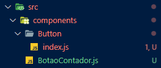
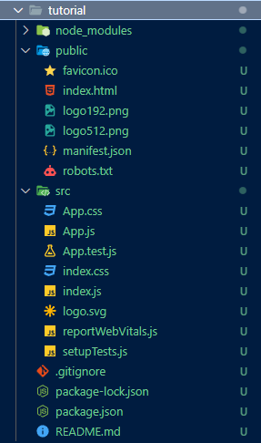

# React

O React é uma biblioteca JavaScript de código aberto amplamente utilizada para a criação de interfaces de usuário interativas e dinâmicas. Desenvolvido e mantido pelo Facebook, o React se destaca por sua abordagem baseada em componentes e sua capacidade de construir aplicativos da web eficientes e reativos.

## Principais Características

- **Componentização**: O React permite que você divida a interface do usuário em componentes reutilizáveis e independentes. Cada componente representa uma parte específica da interface e pode ser facilmente composto para criar interfaces complexas.

- **Virtual DOM**: O React utiliza um Virtual DOM para otimizar as atualizações de interface. Ele compara o estado atual da interface com o estado anterior e faz as atualizações necessárias apenas nas partes que mudaram, melhorando significativamente o desempenho.

- **Unidirecionalidade de Dados**: O React segue o princípio de fluxo unidirecional de dados. Os dados fluem de pais para filhos por meio de props, tornando o rastreamento de dados e o depuramento mais previsíveis.

- **JSX**: O React introduz o JSX (JavaScript XML), uma extensão do JavaScript que permite a criação de elementos de interface de forma declarativa e intuitiva.

- **Ecosistema Rico**: O React possui um ecossistema robusto de bibliotecas e ferramentas, incluindo o React Router para gerenciamento de rotas, o Redux para gerenciamento de estado global e muitos outros recursos.

### Vantagens

- Alta performance devido ao Virtual DOM.
- Facilidade de teste de componentes isolados.
- Comunidade ativa e vasta documentação.
- Reutilização de componentes acelera o desenvolvimento.

### Desvantagens

- Curva de aprendizado inicial, especialmente para iniciantes em JavaScript.
- Pode exigir configuração adicional usando ferramentas como o Create React App.
- Gerenciamento de estado em aplicativos maiores pode ser complexo.

## jsx

Um arquivo com a extensão `.jsx` é um tipo de arquivo utilizado em projetos React para definir componentes da interface do usuário. Essa extensão é uma convenção para indicar que o arquivo contém código JavaScript estendido (JSX), que é uma extensão da linguagem JavaScript usada no desenvolvimento de aplicativos React. A diferença principal entre um arquivo `.jsx` e um arquivo `.js` em um projeto React é a presença de código JSX e a integração com as funcionalidades do React.

Aqui está um exemplo que destaca a diferença entre um arquivo `.jsx` e um arquivo `.js` em um projeto React:

**Arquivo `.js` (sem JSX):**

```javascript
// app.js
function App() {
  return 'Hello, World!';
}

export default App;
```

Neste exemplo, o arquivo `.js` contém uma função `App` que retorna uma simples string.

**Arquivo `.jsx` (com JSX):**

```jsx
// app.jsx
import React from 'react';

function App() {
  return <div>Hello, World!</div>;
}

export default App;
```

Neste exemplo, o arquivo `.jsx` usa a biblioteca React, importada com `import React from 'react'`. Ele também usa código JSX, que é uma extensão da sintaxe JavaScript e permite que você escreva elementos de interface do usuário de forma declarativa. No retorno da função `App`, usamos elementos JSX, como `<div>`, para definir a estrutura do componente.

A diferença fundamental entre os dois exemplos está no uso de JSX e na integração com o React. Os arquivos `.jsx` são usados para definir componentes React que incorporam JSX, enquanto os arquivos `.js` podem conter código JavaScript padrão, mas geralmente não são usados para definir componentes React.

Em um projeto React, a convenção é usar arquivos `.jsx` para componentes React, pois eles facilitam a leitura e a escrita de código de interface do usuário. O React utiliza o processo de transpilação para converter código JSX em JavaScript válido para o navegador. Portanto, quando você escreve código em arquivos `.jsx`, ele é transpilado para JavaScript puro antes de ser executado no navegador.

Vale notar que, o `create-react-app` foi projetado para tornar o processo de desenvolvimento React mais acessível e simplificado, e uma das decisões de design foi permitir que você use JSX diretamente em arquivos com extensão .js.

No entanto, em muitos projetos React, a extensão .jsx é usada para indicar explicitamente que um arquivo contém código JSX. Em resumo, tanto .js quanto .jsx podem ser usados para arquivos com código JSX em projetos React, mas a convenção mais comum é usar .jsx para maior clareza.

## Componentes

### Criando componente

Os componentes devem ser criados separadamente dentro da pasta /components dentro da pasta /src.



Veja o conteúdo do BotaoContador.js:

```javascript
import React, { useState } from 'react';

function BotaoContador() {
    const [contador, setContador] = useState(0);
  
    const aumentarContador = () => {
      setContador(contador + 1);
    };
  
    const diminuirContador = () => {
      setContador(contador - 1);
    };
  
    return (
      <div>
        <h1>Contador: {contador}</h1>
        <button onClick={aumentarContador}>Aumentar</button>
        <button onClick={diminuirContador}>Diminuir</button>
      </div>
    );
  }
  export default BotaoContador;
```

Com isso, o componente pode ser importado pelo index.js na raiz do projeto assim:


```javascript
...
import BotaoContador from './components/BotaoContador';

const root = ReactDOM.createRoot(document.getElementById('root'));
root.render(
  <React.StrictMode>
    <App />
    <BotaoContador />
  </React.StrictMode>
);
...

```

Para facilitar a integração com arquivo css posterior, o arquivo pode ser criado dentro de uma pasta (ex: Button) e dentro dela o arquivo index.js de modo que, quando a pasta for indicada, o .js será usado automaticamente como em:

```bash
import Button from './components/Button'
```

### Ciclo dos componenetes

O ciclo de vida de um componente em uma aplicação React é uma série de eventos que ocorrem durante a vida útil desse componente, desde sua criação até sua remoção. Esses eventos permitem que você controle o comportamento e a interação do componente com o DOM e com os dados. Aqui está um resumo dos principais estágios do ciclo de vida de um componente React:

1. **Montagem (Mounting):**
   - `constructor()`: É chamado quando um componente é inicializado. Você pode configurar o estado inicial e vincular métodos aqui.
   - `static getDerivedStateFromProps()`: Chamado antes da renderização quando as props são recebidas. Raramente usado, geralmente para computar um novo estado com base nas props.
   - `render()`: Obrigatório. Renderiza o componente e seus elementos filhos no DOM virtual.
   - `componentDidMount()`: Chamado após o componente ser inserido no DOM real. É o lugar apropriado para carregar dados externos ou executar operações que dependem do DOM.

2. **Atualização (Updating):**
   - `static getDerivedStateFromProps()`: Novamente, pode ser usado para atualizar o estado com base nas novas props.
   - `shouldComponentUpdate()`: Permite otimizar o desempenho decidindo se a atualização e a renderização devem ocorrer. Pode retornar `true` ou `false`.
   - `render()`: Re-renderiza o componente se `shouldComponentUpdate` retornar `true`.
   - `getSnapshotBeforeUpdate()`: Pode ser usado para capturar informações do DOM antes de sofrer atualizações.
   - `componentDidUpdate()`: Chamado após a renderização e atualização do componente. Útil para ações pós-atualização, como chamadas de API.

3. **Desmontagem (Unmounting):**
   - `componentWillUnmount()`: Chamado antes do componente ser removido do DOM. Útil para limpar recursos, cancelar assinaturas, etc.

4. **Manejo de Erros (Error Handling):**
   - `static getDerivedStateFromError()`: Usado para atualizar o estado quando ocorre um erro em qualquer componente filho.
   - `componentDidCatch()`: Usado para lidar com erros em componentes filhos. Geralmente usado para registro de erros.

É importante notar que com a introdução dos Hooks (a partir do React 16.8), como `useState`, `useEffect`, `useContext`, etc., o ciclo de vida dos componentes baseados em classe não é mais a única maneira de gerenciar o estado e os efeitos em componentes React. Hooks oferecem uma abordagem mais simples e funcional para alcançar os mesmos resultados, tornando o código mais legível e fácil de manter.

Os dois Hooks mais importantes nesse contexto são `useState` e `useEffect`.

1. **useState**:
   - `useState` é um Hook que permite que os componentes funcionais tenham seu próprio estado interno. Isso é crucial para a manipulação de dados locais no componente, permitindo que ele reaja a mudanças de estado sem a necessidade de criar uma classe.
   - No ciclo de vida de um componente, `useState` desempenha um papel fundamental na etapa de "Montagem". Você pode usá-lo para inicializar o estado do componente no momento em que ele é montado no DOM. Além disso, ele permite que você atualize e gerencie o estado ao longo do ciclo de vida do componente.

2. **useEffect**:
   - `useEffect` é um Hook que lida com efeitos colaterais, como busca de dados, interações com APIs externas, atualizações do DOM, etc. Ele é essencial na etapa de "Montagem" e "Atualização" do ciclo de vida do componente.
   - Em um componente funcional, você pode usar `useEffect` para executar código após a renderização do componente e, opcionalmente, após atualizações do estado ou propriedades. Isso é semelhante aos métodos `componentDidMount`, `componentDidUpdate` e `componentWillUnmount` em componentes de classe.
   - `useEffect` é importante para garantir que os efeitos colaterais ocorram no momento apropriado, evitando problemas de desempenho e comportamento inesperado.

Aqui está um exemplo simples de como `useState` e `useEffect` são usados em um componente funcional:

```jsx
import React, { useState, useEffect } from 'react';

function MyComponent() {
  const [count, setCount] = useState(0);

  useEffect(() => {
    // Este código é executado após a montagem do componente e sempre que 'count' for atualizado.
    document.title = `Contagem: ${count}`;
  }, [count]);

  const increment = () => {
    setCount(count + 1);
  };

  return (
    <div>
      <p>Contagem: {count}</p>
      <button onClick={increment}>Incrementar</button>
    </div>
  );
}

export default MyComponent;
```

Neste exemplo, `useState` é usado para manter o estado do contador, e `useEffect` é usado para atualizar o título da página toda vez que o estado `count` muda. Isso demonstra como Hooks simplificam o gerenciamento de estado e efeitos colaterais em componentes funcionais, tornando o código mais legível e fácil de manter.

### Conseguindo componentes

1. **npm (Node Package Manager):** O npm é o repositório de pacotes JavaScript mais utilizado. Você pode procurar por componentes React prontos, bibliotecas e pacotes relacionados ao seu projeto. Para instalar um pacote, você pode usar o comando `npm install`.

2. **GitHub:** O GitHub é uma plataforma de hospedagem de código fonte que contém muitos projetos open source. Você pode procurar por repositórios de componentes React e baixar o código-fonte ou instalar as bibliotecas diretamente em seu projeto.

3. **npmjs.com:** O site do npm, npmjs.com, possui uma interface de busca amigável para encontrar pacotes JavaScript, incluindo componentes React.

4. **React Components Websites:** Existem sites dedicados a listar e compartilhar componentes React. Alguns exemplos incluem "React Awesome" (https://github.com/enaqx/awesome-react) e "React Components" (https://reactjs.org/community/ui-components.html).

5. **Material-UI, Ant Design, Bootstrap, etc.:** Muitas bibliotecas populares de design e UI, como Material-UI, Ant Design e Bootstrap, oferecem componentes React prontos para uso. Você pode encontrar essas bibliotecas em seus respectivos sites e documentações.

6. **Plataformas de Componentes:** Algumas plataformas online oferecem componentes React personalizáveis e prontos para uso, como Bit (https://bit.dev/), Storybook (https://storybook.js.org/), e mais.

Lembre-se sempre de verificar a documentação e as instruções de instalação de qualquer componente que você escolher para entender como usá-lo em seu projeto. Certifique-se de que os componentes escolhidos são compatíveis com a versão do React que você está usando.

Além disso, ao usar componentes de terceiros, considere verificar sua popularidade, manutenção ativa e compatibilidade com seu projeto, para garantir uma integração suave e um desenvolvimento eficiente.

#### Biblioteca de componentes

- Chakra: Chakra UI é uma biblioteca de componentes para React que facilita a criação de interfaces bonitas e acessíveis. Ele é altamente personalizável e oferece uma ampla variedade de componentes prontos para uso.

- Material UI: Material UI é uma popular biblioteca de componentes baseada no design Material, desenvolvido pelo Google. Ela fornece um conjunto completo de componentes estilizados, seguindo as diretrizes de design do Material.

- Tailwind CSS: Embora não seja uma biblioteca de componentes, o Tailwind CSS é um framework de estilo altamente configurável. Ele permite a criação rápida e personalizada de interfaces com base em classes CSS utilitárias.

- Theme UI: Theme UI é uma biblioteca de estilização para React que permite a fácil personalização de temas em aplicativos. Ele funciona bem com outras bibliotecas, como Gatsby e Next.js.

## Props

Uma propriedade (ou "prop") é parte do modelo de programação do React para lidar com eventos como cliques em elementos, botões, etc. O React permite que você passe props para componentes, o que torna a personalização e o comportamento dos componentes altamente configuráveis.

Existem várias props comumente usadas em elementos do React. Algumas das props importantes incluem:

1.  `onClick`: A prop "onClick" é usada para definir uma função que será executada quando o elemento for clicado. Por exemplo, em um botão, você pode definir uma função que será chamada quando o botão for clicado.

2.  `className`: A prop "className" é usada para definir a classe CSS do elemento. Ela permite que você aplique estilos personalizados a um elemento.

3.  `style`: A prop "style" permite que você defina estilos inline para um elemento usando um objeto JavaScript. Isso é útil para estilos específicos que não são reutilizáveis.

4.  `id`: A prop "id" define o ID do elemento, tornando-o acessível para seleção via JavaScript ou CSS.

5.  `value`: Usada em elementos de entrada, como campos de texto, a prop "value" define ou obtém o valor do elemento. É comumente usado para controlar o estado desses elementos.

6.  `disabled`: A prop "disabled" define se o elemento está desabilitado ou não. Por exemplo, pode ser usada para desabilitar um botão.

7.  `onChange`: A prop "onChange" é usada para lidar com eventos de mudança, geralmente associados a elementos de entrada, como campos de texto. Ela permite que você execute código quando o valor do elemento é alterado.

8.  `onSubmit`: Usada em formulários, a prop "onSubmit" é usada para lidar com eventos de envio do formulário. Ela permite que você execute código quando o formulário é enviado.

9.  `key`: A prop "key" é usada em listas para ajudar o React a identificar elementos de maneira eficiente. Ela é frequentemente usada em iterações de lista para garantir que os elementos da lista sejam únicos.

10. `src`: A prop "src" é comumente usada em elementos de imagem (por exemplo, ``) para especificar a fonte da imagem.

11. `href`: Usada em âncoras (por exemplo, `<a>`), a prop "href" define o URL de destino para o link.

12. `target`: Em âncoras, a prop "target" especifica o destino da navegação, como "_blank" para abrir o link em uma nova guia.

13. `alt`: Usada em elementos de imagem, a prop "alt" fornece um texto alternativo que é exibido se a imagem não puder ser carregada.

14. `checked`: Usada em elementos de entrada de tipo "checkbox" e "radio" para determinar se o elemento está marcado como selecionado ou não.

15. `defaultValue`: Usada em elementos de entrada para definir um valor padrão que será exibido inicialmente, mas não controlará o estado do elemento.

Essas são apenas algumas das props mais comuns. A escolha de quais props usar depende da necessidade específica do seu componente. Além disso, você pode passar props personalizadas para seus próprios componentes para personalizá-los de acordo com sua lógica de aplicação. O React é altamente configurável e flexível nesse aspecto.

## Hooks

Os Hooks são uma característica introduzida no React 16.8 que permitem que você use o estado e outros recursos do React em componentes funcionais, em vez de componentes de classe. Isso tornou o desenvolvimento de componentes mais simples e reutilizáveis. Abaixo estão alguns dos principais Hooks do React:

1. **useState**:
   - O `useState` permite que os componentes funcionais tenham estado. Ele retorna um par de valores: o estado atual e uma função para atualizar esse estado.

2. **useReducer**:
   - O `useReducer` é uma alternativa ao `useState` quando se trata de gerenciar estados complexos. Ele é especialmente útil quando o estado depende do estado anterior e requer lógica mais avançada.

3. **useEffect**:
   - O `useEffect` é usado para lidar com efeitos colaterais em componentes funcionais. Você pode realizar ações como buscar dados, inscrever-se em eventos e muito mais. Ele é executado após cada renderização do componente.

4. **useContext**:
   - O `useContext` é usado para acessar o contexto de um componente. O contexto permite compartilhar dados entre componentes sem precisar passá-los explicitamente por meio das propriedades.

5. **useRef**:
   - O `useRef` permite criar uma referência para um elemento do DOM ou para qualquer valor que precise ser persistido entre renderizações. É útil para acessar diretamente elementos do DOM ou para manter valores mutáveis.

6. **useMemo**:
   - O `useMemo` é usado para memoizar o resultado de uma função caras em termos de desempenho. Ele retorna uma versão memorizada da função que só é recalculada quando as dependências mudam.

7. **useCallback**:
   - O `useCallback` é semelhante ao `useMemo`, mas é usado para memorizar funções. Ele retorna uma versão memorizada da função que só é recalculada quando as dependências mudam.

8. **useLayoutEffect**:
   - O `useLayoutEffect` é semelhante ao `useEffect`, mas é sincronizado com o processo de layout do navegador. Ele é útil em cenários em que você precisa realizar ações imediatamente após a renderização, antes da atualização da tela.

9. **useCustomHook** (Hooks personalizados):
   - Você também pode criar seus próprios Hooks personalizados, que são funções que combinam Hooks do React para encapsular a lógica específica do seu componente. Isso permite a reutilização de lógica em vários componentes.

Esses são alguns dos principais Hooks do React, mas existem outros disponíveis, e você pode criar seus próprios Hooks personalizados para atender às necessidades específicas do seu aplicativo. O uso de Hooks torna os componentes funcionais uma opção poderosa e flexível no desenvolvimento de aplicações React.

**Exemplo**

```javascript
import React, { useState, useEffect, useMemo, useCallback } from 'react';

const Counter = () => {
  // useState para controlar o estado do contador
  const [count, setCount] = useState(0);

  // useState para armazenar o número de multiplicação
  const [multiplier, setMultiplier] = useState(2);

  // useEffect para realizar ações após a renderização
  useEffect(() => {
    document.title = `Contador: ${count}`;
  }, [count]); // Executa apenas quando 'count' muda

  // useMemo para calcular um valor memorizado
  const doubledCount = useMemo(() => count * 2, [count]);

  // useCallback para memoizar a função de incremento
  const increment = useCallback(() => {
    setCount((prevCount) => prevCount + 1);
  }, []);

  return (
    <div>
      <p>Contador: {count}</p>
      <p>Contador dobrado: {doubledCount}</p>
      <p>Número de multiplicação: {multiplier}</p>

      {/* Botão para incrementar o contador */}
      <button onClick={increment}>Incrementar</button>

      {/* Input para alterar o número de multiplicação */}
      <input
        type="number"
        value={multiplier}
        onChange={(e) => setMultiplier(Number(e.target.value))}
      />
    </div>
  );
};

export default Counter;

```

Neste exemplo:

- `useState` é usado para gerenciar o estado do contador e o número de multiplicação.
- `useEffect` é utilizado para atualizar o título da página sempre que o contador muda.
- `useMemo` é empregado para calcular o dobro do contador, evitando recálculos desnecessários.
- `useCallback` é usado para memorizar a função de incremento, garantindo que ela não seja recriada em cada renderização.

## React Hook Forms

React Hook Forms é uma biblioteca para gerenciar formulários em React utilizando hooks. Ele oferece uma abordagem simples e eficiente para lidar com a lógica de formulários no React, utilizando hooks como `useForm`, `useFieldArray`, entre outros.

**Utilidade:**

1. **Simplicidade e Legibilidade:** O React Hook Forms simplifica a lógica dos formulários, tornando o código mais limpo e fácil de entender.

2. **Performance:** Ao utilizar o conceito de "controlled components", o React Hook Forms otimiza a performance dos formulários, garantindo que apenas os campos afetados sejam renderizados novamente.

3. **Validação:** Oferece suporte à validação de formulários, permitindo a definição de regras de validação de forma simples e eficaz.

4. **Hooks Personalizáveis:** Permite criar hooks personalizados para atender a necessidades específicas do seu aplicativo.

**Exemplos de Uso:**

Vamos supor que você está criando um formulário de cadastro de usuário com campos como nome, e-mail e senha.

```jsx
import React from 'react';
import { useForm, Controller } from 'react-hook-form';

function RegistrationForm() {
  const { handleSubmit, control, errors } = useForm();

  const onSubmit = (data) => {
    console.log(data);
    // Lógica para enviar os dados para o servidor
  };

  return (
    <form onSubmit={handleSubmit(onSubmit)}>
      <div>
        <label>Nome:</label>
        <Controller
          name="name"
          control={control}
          render={({ field }) => <input {...field} />}
        />
      </div>
      <div>
        <label>E-mail:</label>
        <Controller
          name="email"
          control={control}
          render={({ field }) => <input type="email" {...field} />}
        />
      </div>
      <div>
        <label>Senha:</label>
        <Controller
          name="password"
          control={control}
          render={({ field }) => <input type="password" {...field} />}
        />
      </div>
      <button type="submit">Cadastrar</button>
    </form>
  );
}

export default RegistrationForm;
```

Este é um exemplo básico, mas o React Hook Forms oferece recursos avançados, como validação de campos, campos dinâmicos e muitos outros. Vale a pena explorar a documentação oficial para obter informações mais detalhadas: [React Hook Forms](https://react-hook-form.com/).

### useForm

Dentro do `useForm` do React Hook Form, você pode passar diversas opções para personalizar o comportamento do formulário. Aqui estão algumas das principais tags e props que podem ser utilizadas:

1. **mode:**
   - **Opções:** `'onSubmit' | 'onBlur' | 'onChange' | 'onTouched' | 'all'`
   - **Descrição:** Define quando a validação do formulário deve ocorrer. Por exemplo, se você definir como `'onBlur'`, a validação será acionada quando o usuário sair de um campo.

```javascript
const { useForm } = require('react-hook-form');

const { register, handleSubmit, formState } = useForm({
  mode: 'onBlur', // Pode ser 'onChange', 'onSubmit', 'onTouched', 'all'
});
```

2. **reValidateMode:**
   - **Opções:** `'onSubmit' | 'onChange' | 'onBlur' | 'onTouched'`
   - **Descrição:** Define quando os campos devem ser revalidados.

```javascript
const { useForm } = require('react-hook-form');

const { register, handleSubmit, formState } = useForm({
  reValidateMode: 'onChange', // Pode ser 'onSubmit', 'onBlur', 'onTouched'
});
```

3. **resolver:**
   - **Descrição:** Define o resolver a ser usado para validar os campos. No caso de uso com Yup, utiliza-se `yupResolver`.

```javascript
import { yupResolver } from '@hookform/resolvers/yup';
import * as yup from 'yup';

const schema = yup.object().shape({
  // Defina seu esquema Yup aqui
});

const { useForm } = require('react-hook-form');

const { register, handleSubmit, formState } = useForm({
  resolver: yupResolver(schema),
});
```

4. **defaultValues:**
   - **Descrição:** Define os valores padrão dos campos do formulário.

```javascript
const { useForm } = require('react-hook-form');

const { register, handleSubmit, setValue } = useForm({
  defaultValues: {
    nome: 'Seu Nome',
    email: 'seu@email.com',
  },
});
```

5. **shouldUnregister:**
   - **Descrição:** Controla se os campos não montados (não renderizados) devem ou não ser removidos automaticamente do estado.

```javascript
const { useForm } = require('react-hook-form');

const { register, handleSubmit } = useForm({
  shouldUnregister: false, // Pode ser true para remover automaticamente campos não renderizados
});
```

Estas são algumas das opções principais que você pode utilizar com `useForm`. Cada uma delas permite que você ajuste o comportamento do formulário de acordo com as necessidades específicas do seu projeto.

### Validação com yup

O `yup` é uma biblioteca de validação de esquemas para JavaScript, frequentemente utilizada em conjunto com o React Hook Form para validação de formulários. Aqui está um resumo desde a instalação até a utilização do `yup` com o React Hook Forms:

1. **Instalação:**
   Certifique-se de ter o React Hook Forms e o Yup instalados no seu projeto. Você pode instalar ambos usando o npm ou yarn:
   ```bash
   npm install react-hook-form yup
   ```

2. **Importação:**
   Importe as bibliotecas necessárias no seu componente:
   ```javascript
   import { useForm } from 'react-hook-form';
   import { yupResolver } from '@hookform/resolvers/yup';
   import * as yup from 'yup';
   ```

3. **Definição do Schema com Yup:**
   Crie um esquema de validação utilizando o `yup`. Por exemplo:
   ```javascript
   const schema = yup.object().shape({
     nome: yup.string().required('O nome é obrigatório'),
     email: yup.string().email('Digite um e-mail válido').required('O e-mail é obrigatório'),
     idade: yup.number().typeError('Digite um número válido').positive('A idade deve ser um número positivo').integer('A idade deve ser um número inteiro'),
   });
   ```

4. **Utilização do Yup Resolver:**
   Configure o resolver do Yup ao criar o formulário com o React Hook Form:
   ```javascript
   const { register, handleSubmit, errors } = useForm({
     resolver: yupResolver(schema),
   });
   ```

5. **Aplicação de Validação nos Campos:**
   Aplique a validação nos campos do formulário usando o `register`:
   ```jsx
   <input {...register('nome')} />
   <span>{errors.nome?.message}</span>

   <input {...register('email')} />
   <span>{errors.email?.message}</span>

   <input {...register('idade')} />
   <span>{errors.idade?.message}</span>
   ```

## Iniciando o React

### Package

Esse arquivo é como se fosse o roteiro da aplicação. Ele é criado dando o comando:

```bash
npm init -y 
```

Criando na pasta corrente o arquivo `package.json`, que diz o nome da aplicação/pasta/projeto, arquivo principal, pacotes utilizados, etc.

```json
{
  "name": "react",
  "version": "1.0.0",
  "description": "",
  "main": "javascript.js",
  "scripts": {
    "test": "echo \"Error: no test specified\" && exit 1"
  },
  "keywords": [],
  "author": "",
  "license": "ISC"
}

```

Ao instalar pacotes, é criado o arquivo `package-lock.json`, que é usado para registrar e fixar as versões exatas das dependências do seu projeto. Ele desempenha um papel importante no gerenciamento de dependências e na garantia de que todas as pessoas que trabalham no projeto obtenham as mesmas versões de pacotes, evitando assim problemas de compatibilidade.

### Babel

O Babel é um transpilador de JavaScript que é amplamente utilizado no desenvolvimento web. Sua função principal é converter código JavaScript escrito em versões mais recentes (ES6, ES7, etc.) em código JavaScript compatível com versões mais antigas, para garantir que ele funcione em navegadores que não suportam os recursos mais recentes da linguagem.

Aqui estão algumas coisas que você precisa saber sobre o Babel:

1. **Transpilação**: O Babel realiza a transpilação, que é um processo de compilação de código de uma linguagem para outra. No caso do Babel, ele converte código JavaScript moderno em JavaScript compatível com versões mais antigas.

2. **Ecossistema JavaScript**: O Babel é uma parte importante do ecossistema JavaScript, permitindo que os desenvolvedores usem recursos mais recentes da linguagem sem se preocupar com a compatibilidade com navegadores mais antigos.

3. **Plugins e Presets**: O Babel é altamente configurável. Você pode adicionar plugins e presets que correspondem aos recursos específicos do JavaScript que deseja usar. Isso permite personalizar o comportamento do Babel de acordo com suas necessidades.

4. **Integração com Ferramentas de Desenvolvimento**: O Babel é frequentemente integrado com outras ferramentas de desenvolvimento, como Webpack, citado a frente, para automatizar o processo de transpilação e criar um fluxo de desenvolvimento mais eficiente.

Para instalar os pacotes básicos do babel, use o comando:

```bash
npm install @babel/core @babel/preset-env @babel/preset-react @babel/cli babel-loader -D
```

Ao instalar, note que o arquivo package.json é alterado, adicionando o babel.

```json
  "devDependencies": {
    "@babel/core": "^7.23.2",
    "@babel/preset-env": "^7.23.2",
    "@babel/preset-react": "^7.22.15",
    "babel-loader": "^9.1.3"
  }
```

Depois, é necessário criar o arquivo de configuração do babel: `.babelrc`. Uma configuração básica seria:

```
{
    "presets": [
        "@babel/preset-env",
        ["@babel/preset-react", {"runtime": "automatic"}]
    ]
}
```

Ou pode criar o arquivo automaticamente usando o comando:

```
npx @babel/cli init
```

### Webpack

O Webpack é uma ferramenta de empacotamento (bundling) amplamente usada no desenvolvimento web. Sua principal função é gerenciar e otimizar os recursos de um projeto, como arquivos JavaScript, CSS, imagens e muito mais. Aqui estão algumas informações essenciais sobre o Webpack:

1. **Empacotamento de Módulos**: O Webpack é especialmente útil para lidar com módulos em projetos JavaScript. Ele permite que você organize seu código em módulos separados e, em seguida, os agrupe em um ou mais pacotes (bundles) que podem ser carregados de forma eficiente pelo navegador.

2. **Carregadores (Loaders)**: O Webpack utiliza carregadores para processar diferentes tipos de arquivos, como JavaScript, CSS, imagens e muito mais. Os carregadores permitem que você transforme e adapte esses arquivos antes de empacotá-los. Por exemplo, você pode usar carregadores para transpilar código ES6+ para ES5, minificar o código JavaScript, ou até mesmo carregar estilos CSS.

3. **Plugins**: Além dos carregadores, o Webpack usa plugins para executar tarefas mais avançadas, como otimização de código, divisão de pacotes, geração de HTML e muito mais. Existem muitos plugins disponíveis na comunidade do Webpack para atender às necessidades específicas do seu projeto.

4. **Code Splitting**: O Webpack suporta a divisão de código (code splitting), que é uma técnica para dividir seu código em vários pacotes menores. Isso pode melhorar o desempenho do carregamento da página, permitindo que partes do código sejam carregadas sob demanda.

5. **Integração com Outras Ferramentas**: O Webpack é frequentemente integrado com outras ferramentas, como o Babel (mencionado anteriormente), para criar fluxos de desenvolvimento eficientes. Essas integrações permitem que você use JavaScript moderno, carregue automaticamente dependências e otimize o desempenho de seu aplicativo.

Para instalá-lo, use o comando:

```bash
npm install html-loader html-webpack-plugin webpack webpack-cli webpack-dev-server style-loader css-loader -D
```

Então, crie o arquivo de configuração `webpack.config.js` com as seguintes instruções básicas:

```javascript
const HtmlWebpackPlugin = require("html-webpack-plugin");
const HtmlWebPackPlugin = require("html-webpack-plugin");

module.exports = {
    devtool: "source-map",
    entry: "./src/index.js",
    module: {
        rules: [
            {
                test: /\.js$/,
                exclude: /node_modules/,
                use: { loader: "babel-loader"}
            },
            {
                test: /\.html$/,
                use: [{ loader: "html-loader"}]
            },
            {
                test: /\.css$/,
                use: ["style-loader", "css-loader"]
            },
            {
                test: /\.(png|jpe?g|gif))$/i,
                use: ["file-loader"]
            },
        ]
    },
    resolve: {
        extensions: [".js", ".jsx"],
    },
    plugin: [
        new HtmlWebpackPlugin({
            template: '.public/index.html'
        })
    ]
}
```

### create-react-app

Para começar um projeto em react de forma mais automática (e usual), use no terminal:

```bash
npx create-react-app nome_do_app
```

em que nome_do_app é o nome do projeto e será o nome da pasta criada, que ficará inicialmente assim:



Então, mude o terminal para a pasta criada:

```bash
cd nome_do_app
```

E para rodar o react, use:

```bash
npm run start
```

## Routers

O `react-router-dom` é uma biblioteca popular no ecossistema React que facilita a navegação e a manipulação de rotas em aplicações web. Ele fornece um conjunto de componentes que ajudam a criar uma experiência de navegação eficiente em uma aplicação de página única (SPA). Aqui está um panorama geral e como você pode usá-lo em um projeto de software:

### Panorama Geral:

1. **BrowserRouter:** É o componente principal que deve envolver toda a aplicação. Ele utiliza a API de histórico do navegador para manter a UI sincronizada com a URL.

2. **Route:** Define como os componentes da interface do usuário (UI) são renderizados com base na URL. Pode ser usado para mapear determinados caminhos para componentes específicos.

3. **Link:** Substitui a tag `<a>` padrão do HTML e é usada para navegar entre diferentes rotas sem recarregar a página inteira.

4. **Switch:** Renderiza apenas o primeiro `Route` ou `Redirect` que coincide com a localização atual. Isso é útil quando você quer garantir que apenas uma rota seja correspondida.

5. **Redirect:** Renderiza um redirecionamento para outra rota.

### Como Usar:

1. **Instalação:**
   Você pode instalar o `react-router-dom` usando o npm ou o yarn:

   ```bash
   npm install react-router-dom
   # ou
   yarn add react-router-dom
   ```

2. **Configuração:**
   - Importe os componentes necessários:

     ```javascript
     import { BrowserRouter as Router, Switch, Routes, Route, Link } from 'react-router-dom';
     ```

3. **Estrutura do Componente:**
   - Envolve a aplicação com o `Router`:

     ```jsx
     <Router>
      
       {/* Suas rotas e componentes aqui */}

     </Router>
     ```

4. **Definindo Rotas:**
   - Use o componente `Route` para mapear caminhos para componentes:

     ```jsx
      <Routes>
        <Route path="/pagina1" component={Pagina1} />
        <Route path="/pagina2" component={Pagina2} />
      </Routes>
     ```

5. **Navegação:**
   - Use o componente `Link` para criar links de navegação:

     ```jsx
     <Link to="/pagina1">Ir para a Página 1</Link>
     ```

6. **Renderização Condicional:**
   - Use o componente `Switch` para garantir que apenas uma rota seja correspondida:

     ```jsx
     <Switch>
       <Route path="/pagina1" component={Pagina1} />
       <Route path="/pagina2" component={Pagina2} />
       <Redirect to="/pagina1" />
     </Switch>
     ```

Essas são apenas as bases. O `react-router-dom` oferece mais recursos, como parâmetros de rota, navegação programática e manipulação do histórico de navegação. Explore a documentação para obter informações mais detalhadas: [React Router Documentation](https://reactrouter.com/web/guides/quick-start).

## Design

### Biblioteca styled-components

A biblioteca "styled-components" é popular para estilização de componentes em aplicações React. Ela permite que você defina estilos CSS diretamente em seus componentes React usando uma sintaxe similar ao CSS-in-JS. Com "styled-components", você pode criar componentes estilizados reutilizáveis que encapsulam seu estilo e lógica, tornando seu código mais modular e legível.

Comece instalando o pacote:

```bash
npm install styled-components
```

Na pasta do componenete, crie um arquivo chamado styles.js e importe o pacote:

```bash
import styled from 'styled-components';
```

nesse arquivo, crie a estilização para o componenete:

```javascript
export const StyledButton = styled.button`
  background-color: #007bff;
  color: white;
  padding: 10px 20px;
  border: none;
  border-radius: 5px;
  cursor: pointer;

  &:hover {
    background-color: #0056b3;
  }
`;

```

Agora, no arquivo com a lógica do componenete (index.js), importe a estilização:

```javascript
import { ButtonContainer } from './styles';

const Button = ({label, onClick}) => {
    return (
      <ButtonContainer onClick={onClick} type="button">
       {label}
      </ButtonContainer>
    );
  }
  
  export default Button;
```

Nessa lógida, o componenete Button terá o css definido em ButtonContainer.

Também é possível criar styles globalmente oi meio de um arquivo global.js na raiz do projeto:

```javascript
import { createGlobalStyle } from 'styled-components'

export default createGlobalStyle`
  *, body {
    margin: 0;
    padding: 0;
  }
`
```

Depois importando no index.js da raiz do projeto:

```javascript
import GlobalStyles from './global';

const root = ReactDOM.createRoot(document.getElementById('root'));
root.render(
  <React.StrictMode>
    <GlobalStyles />
    <App />
  </React.StrictMode>
);
```

### Fonte especial

#### Baixando a fonte

**Passo 1: Preparando sua Fonte**

Certifique-se de ter a fonte que deseja adicionar ao seu projeto no formato correto (normalmente .ttf ou .otf). Você deve ter a fonte pronta para uso.

**Passo 2: Organizando a Estrutura do Projeto**

Em seu projeto React, crie uma pasta chamada "fonts" na raiz do projeto. Esta pasta conterá seus arquivos de fonte.

**Passo 3: Adicionando a fonte ao Projeto**

No arquivo global.js, em que são configurados os estilos globais, Siga os seguintes passos:

a. **Importe a Fonte:** No arquivo de estilos do seu componente (geralmente um arquivo .js ou .css), importe a fonte.

```javascript
import { createGlobalStyle } from 'styled-components'
import SuaFonte from './fonts/SuaFonte.ttf';
```

b. **Defina o `@font-face`:** Dentro das definições de estilo do seu componente, crie uma regra `@font-face` para a sua fonte.

```javascript
`...
  @font-face {
    font-family: 'SuaFonte';
    src: url(${SuaFonte}) format('truetype');
  }
`
```

**Passo 3: Importando a Fonte no Estilo do Componente**

No componente onde deseja usar a fonte, use a fonte normalmente:

```javascript
  font-family: 'LEDCalculator';
```

#### Fonte com API do Goggle

É possível utilizar uma fonte disponível em [https://fonts.google.com/]. Para tal, escolha uma fonte de interesse no site fornecido e clique no mesmo. Então, uma janela lateral aparecerá com conteúdo html para ser copiado, como na imagem:


Copie o conteúdo HTML na `<head>` do arquivo `index.html` da pasta public do projeto react e use o CSS especificado logo abaixo do HTML copiável para chamar essa fonte onde quiser.

## Padronizações

### Eslint

O ESLint é uma ferramenta de linting para JavaScript que ajuda a identificar e corrigir erros, padrões de código inconsistentes e problemas de estilo em seu código. Ele é comumente usado em projetos React (e outros projetos JavaScript) para manter um código limpo e consistente. Ele é adicionado automaticamente quando projeto é criado com `create-react-app`, mas pode ser feito manulamente com:

```bash
npm install eslint -D
npx eslint --init
```

Siga os passos da configuração conforme for solicitado no terminal e então rode o comando `npx eslint .` para listar os erros no projeto.

Para mais informações, acesse: [eslint.org]

### Prettier

Prettier é uma ferramenta de formatação de código que ajuda a manter um estilo de código consistente em projetos. Ele pode ser usado em projetos React, bem como em muitas outras linguagens de programação. Prettier formata automaticamente o código de acordo com as regras de estilo predefinidas, o que ajuda a evitar debates sobre a formatação do código entre membros da equipe e torna o código mais legível.

Ele é adicionado automaticamente quando projeto é criado com `create-react-app`, mas para adicionar o Prettier manualmente, siga estes passos:

1. Instale o Prettier: Você pode instalá-lo globalmente ou localmente no projeto. É comum instalá-lo como uma dependência de desenvolvimento no projeto, assim:

   ```bash
   npm install --save-dev prettier
   ```

2. Configure as opções do Prettier: Você pode criar um arquivo chamado `.prettierrc` na raiz do seu projeto para definir as opções de formatação que deseja. Por exemplo, você pode configurar a largura máxima da linha, o estilo de quebra de linha, entre outras coisas. Aqui está um exemplo de uma configuração básica:

   ```json
    {
      "semi": true,
      "tabWidth": 4,
      "printWidth": 100,
      "singleQuote": true,
      "trailingComma": "none",
      "jsxSingleQuote": true,
    }
   ```

3. Formate o código: Você pode usar o Prettier para formatar todo o código do seu projeto executando o seguinte comando no terminal:

   ```bash
   npx prettier --write .
   ```

   Isso formatará todos os arquivos do projeto de acordo com as regras definidas no arquivo `.prettierrc`.

Para mais informações, acesse: [prettier.io]

### Editor Config

O EditorConfig é um pacote que ajuda a manter a consistência no estilo de formatação do código-fonte em projetos. Ele não faz parte do Create React App, mas pode ser usado em projetos React ou em qualquer projeto que envolva código-fonte.

Para utilizá-lo, siga estas etapas:

1. **Instalação do EditorConfig:**
   Primeiro, você precisa ter o EditorConfig instalado em seu ambiente de desenvolvimento. Você pode instalar o pacote globalmente com npm ou yarn:

   ```bash
   npm install editorconfig -D
   ```

2. **Configuração do arquivo .editorconfig:**
   Crie um arquivo chamado `.editorconfig` na raiz do seu projeto. Este arquivo contém as regras de formatação que você deseja aplicar ao código. Aqui está um exemplo de um arquivo `.editorconfig`:

   ```ini
   # Arquivo de configuração EditorConfig
   root = true

   [*]
   indent_style = space
   indent_size = 4
   end_of_line = lf
   charset = utf-8
   trim_trailing_whitespace = true
   insert_final_newline = true

   [*.md]
   trim_trailing_whitespace = false
   ```

   Este exemplo define algumas regras básicas, como tamanho da indentação, estilo, fim de linha, charset e remoção de espaços em branco no final. Para mais informações, acesse: [editorconfig.org]

3. **Integração com o Editor de Código:**
   A maioria dos editores de código modernos tem suporte nativo para arquivos `.editorconfig`, o que significa que as regras definidas no arquivo serão automaticamente aplicadas ao seu código quando você o salvar. Não é necessário instalar nenhum plugin adicional no seu editor para que isso funcione.

O EditorConfig é uma ferramenta útil para manter a consistência no estilo de código entre membros da equipe e ao colaborar em projetos de código aberto. Certifique-se de ajustar as configurações no arquivo `.editorconfig` de acordo com as convenções de estilo do seu projeto.

## Conclusão

O React é uma escolha popular para o desenvolvimento de aplicativos da web modernos devido à sua eficiência, flexibilidade e comunidade ativa. Com sua abordagem baseada em componentes e recursos avançados, ele continua a ser uma ferramenta poderosa para construir interfaces de usuário dinâmicas e interativas.

Para saber mais sobre o React, consulte a [documentação oficial](https://reactjs.org/).