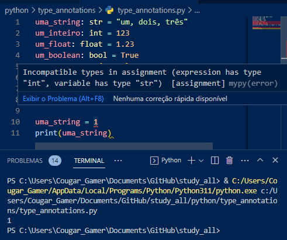
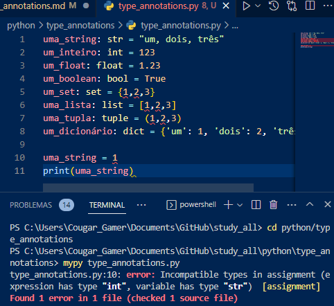
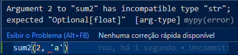
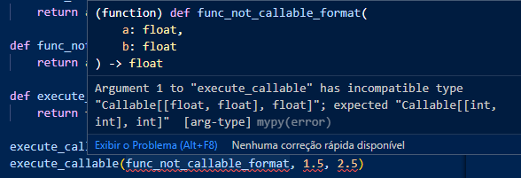

# Type Annotations

 Type annotations são uma forma de especificar os tipos de dados esperados em uma determinada variável, argumento de função ou valor de retorno de função. As type annotations podem ajudar a tornar o código mais legível, mais fácil de entender e mais fácil de manter.

## Python

### Configurações

Em python, para tal, se utiliza a biblioteca "mypy". Antes de começar, se quiser isolar o projeto, faça um ambiente virtual (venv). Para instalá-la, use:

    pip install mypy
    pip install flake8

Em settings.json, antes da última chaves, adicione as seguintes configurações:

    "python.linting.flake8Enabled": true,
    "python.linting.mypyEnabled": true,

Isso permitirá que você faça algumas tarefas sem ter de executar o mypy diretamente no terminal.

### Básico

Agora você pode definir o tipo da variável criada como em:

    uma_string: str = "um, dois, três"
    outra_string: str

Se você só definir o tipo da variável, sem declará-la, ela será criada dentro do dunder(anotations) como mostrado:

Ao tentar mudar o tipo da variável que foi definida usando type_annotations, a IDE indicará o erro após o arquivo ter sido salvo. Não impedirá o script de rodar, entretanto.

Salvo se o arquivo fosse executado no terminal via o mypy, que exibiria o erro como a IDE mostra.

Para definir os tipos de parâmetros de funções, e o tipo do que deve ser retornado, faça da seguinte forma:

    def soma(x: int, y: float) -> float:

Os erros serão exibidos da seguinte forma:

Para definir tipos de elementos dentro de outros elementos (como listas e sets), faça da seguinte forma:

    lista_inteiros: list[int] = [1, 2, 3, 4]
    conjunto_strings: set[str] = {"1", "2", "3", "4"}

O erro ao inserir um valor inadequado ficará assim:

Para definir chave e valor de um dicionário, faça da seguinte forma:

    um_dict: dict[str, int] = {"A": 0}

O erro ao inserir uma chave ou valor inadequado ficará assim:

### Type Aliases

Você pode guardar em uma variável os type annotations e reutilizá-los como em:

    int_list = list[int]
    DictListaInteiros = dict[str, int_list]

### Type Union

Você também pode declarar mais de um tipo para a mesma variável como em:

    string_e_inteiros: str | int
    string_e_inteiros = "A"
    string_e_inteiros = 2

De fato, o que está sendo feito é criar um outro tipo, chamado de union, que recebe o declarado. Veja o erro em caso fora:

### Type Option

Você também pode declarar um tipo opcional para a variável como em:

    def sum2(x: int, y: float | None = None) -> float:
        return x + y

De fato, o que está sendo feito é criar um outro tipo, chamado de optional, que recebe o declarado. Veja o erro em caso fora:

### Type Callable

O tipo callable é como se transformasse uma função em uma variável, como em:

    from collections.abc import Callable

    def execute_callable(func: Callable[[int, int], int], a: int, b: int) -> int:
        return func(a, b)

Se não seguir a ordem como definida no callable, derá o seguinte erro:

### Type Typevar

Outra manobra que pode ser feita é a declaração de um tipo novo, genérico ou dinâmico tipo de variável. Isso pode ser feito da seguinte forma:

    from typing import TypeVar

    T = TypeVar('T')

    def get_item(list: list[T], index: int) -> dynamic:
        return list[index]

### Type Class

Também é possível utilizar as classes como tipos, o que é muito útil, como em:

    class Person:
        def __init__(self, firstname, lastname):
            self.firstname = firstname
            self.lastname = lastname

        @property
        def full_name(self):
            return f"{self.firstname} {self.lastname}"

    def say_my_name(person: Person) -> str:
        return person.full_name

Inclusive, isso faz a IDE indicar quais são os atributos e métodos disponíveis, pois quando o é declarado, a IDE consegue encontrá-los.
