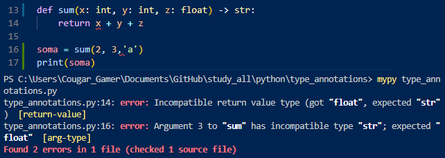
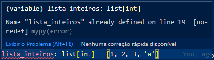
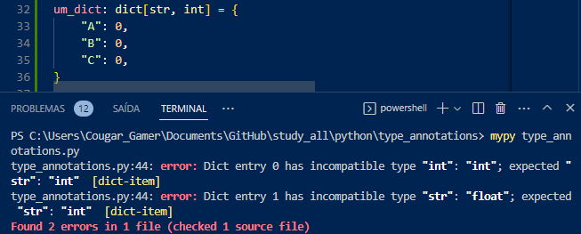

# Type Annotations

 Type annotations são uma forma de especificar os tipos de dados esperados em uma determinada variável, argumento de função ou valor de retorno de função. As type annotations podem ajudar a tornar o código mais legível, mais fácil de entender e mais fácil de manter.

## Python

### Configurações

Em python, para tal, se utiliza a biblioteca "mypy". Antes de começar, se quiser isolar o projeto, faça um ambiente virtual (venv). Para instalá-la, use:

    pip install mypy
    pip install flake8

Em settings.json, antes da última chaves, adicione as seguintes configurações:

    "python.linting.flake8Enabled": true,
    "python.linting.mypyEnabled": true,

Isso permitirá que você faça algumas tarefas sem ter de executar o mypy diretamente no terminal.

### Básico

Agora você pode definir o tipo da variável criada como em:

    uma_string: str = "um, dois, três"
    um_inteiro: int = 123

Ao tentar mudar o tipo da variável que foi definida usando type_annotations, a IDE indicará o erro após o arquivo ter sido salvo. Não impedirá o script de rodar, entretanto.

Salvo se o arquivo fosse executado no terminal via o mypy, que exibiria o erro como a IDE mostra.

Para definir os tipos de parâmetros de funções, e o tipo do que deve ser retornado, faça da seguinte forma:

    def soma(x: int, y: float) -> float:

Os erros serão exibidos da seguinte forma:

Para definir tipos de elementos dentro de listas, faça da seguinte forma:

    lista_inteiros: list[int] = [1, 2, 3, 4]

O erro ao inserir um valor inadequado ficará assim:

Para definir chave e valor de um dicionário, faça da seguinte forma:

    um_dict: dict[str, int] = {"A": 0}

O erro ao inserir uma chave ou valor inadequado ficará assim:

