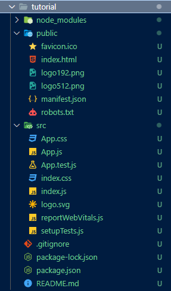
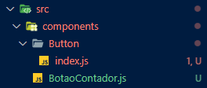

# React

O React é uma biblioteca JavaScript de código aberto amplamente utilizada para a criação de interfaces de usuário interativas e dinâmicas. Desenvolvido e mantido pelo Facebook, o React se destaca por sua abordagem baseada em componentes e sua capacidade de construir aplicativos da web eficientes e reativos.

## Principais Características

- **Componentização**: O React permite que você divida a interface do usuário em componentes reutilizáveis e independentes. Cada componente representa uma parte específica da interface e pode ser facilmente composto para criar interfaces complexas.

- **Virtual DOM**: O React utiliza um Virtual DOM para otimizar as atualizações de interface. Ele compara o estado atual da interface com o estado anterior e faz as atualizações necessárias apenas nas partes que mudaram, melhorando significativamente o desempenho.

- **Unidirecionalidade de Dados**: O React segue o princípio de fluxo unidirecional de dados. Os dados fluem de pais para filhos por meio de props, tornando o rastreamento de dados e o depuramento mais previsíveis.

- **JSX**: O React introduz o JSX (JavaScript XML), uma extensão do JavaScript que permite a criação de elementos de interface de forma declarativa e intuitiva.

- **Ecosistema Rico**: O React possui um ecossistema robusto de bibliotecas e ferramentas, incluindo o React Router para gerenciamento de rotas, o Redux para gerenciamento de estado global e muitos outros recursos.

### Vantagens

- Alta performance devido ao Virtual DOM.
- Facilidade de teste de componentes isolados.
- Comunidade ativa e vasta documentação.
- Reutilização de componentes acelera o desenvolvimento.

### Desvantagens

- Curva de aprendizado inicial, especialmente para iniciantes em JavaScript.
- Pode exigir configuração adicional usando ferramentas como o Create React App.
- Gerenciamento de estado em aplicativos maiores pode ser complexo.

## Props de react

Uma propriedade (ou "prop") é parte do modelo de programação do React para lidar com eventos como cliques em elementos, botões, etc. O React permite que você passe props para componentes, o que torna a personalização e o comportamento dos componentes altamente configuráveis.

Existem várias props comumente usadas em elementos do React. Algumas das props importantes incluem:

1.  `onClick`: A prop "onClick" é usada para definir uma função que será executada quando o elemento for clicado. Por exemplo, em um botão, você pode definir uma função que será chamada quando o botão for clicado.

2.  `className`: A prop "className" é usada para definir a classe CSS do elemento. Ela permite que você aplique estilos personalizados a um elemento.

3.  `style`: A prop "style" permite que você defina estilos inline para um elemento usando um objeto JavaScript. Isso é útil para estilos específicos que não são reutilizáveis.

4.  `id`: A prop "id" define o ID do elemento, tornando-o acessível para seleção via JavaScript ou CSS.

5.  `value`: Usada em elementos de entrada, como campos de texto, a prop "value" define ou obtém o valor do elemento. É comumente usado para controlar o estado desses elementos.

6.  `disabled`: A prop "disabled" define se o elemento está desabilitado ou não. Por exemplo, pode ser usada para desabilitar um botão.

7.  `onChange`: A prop "onChange" é usada para lidar com eventos de mudança, geralmente associados a elementos de entrada, como campos de texto. Ela permite que você execute código quando o valor do elemento é alterado.

8.  `onSubmit`: Usada em formulários, a prop "onSubmit" é usada para lidar com eventos de envio do formulário. Ela permite que você execute código quando o formulário é enviado.

9.  `key`: A prop "key" é usada em listas para ajudar o React a identificar elementos de maneira eficiente. Ela é frequentemente usada em iterações de lista para garantir que os elementos da lista sejam únicos.

10. `src`: A prop "src" é comumente usada em elementos de imagem (por exemplo, ``) para especificar a fonte da imagem.

11. `href`: Usada em âncoras (por exemplo, `<a>`), a prop "href" define o URL de destino para o link.

12. `target`: Em âncoras, a prop "target" especifica o destino da navegação, como "_blank" para abrir o link em uma nova guia.

13. `alt`: Usada em elementos de imagem, a prop "alt" fornece um texto alternativo que é exibido se a imagem não puder ser carregada.

14. `checked`: Usada em elementos de entrada de tipo "checkbox" e "radio" para determinar se o elemento está marcado como selecionado ou não.

15. `defaultValue`: Usada em elementos de entrada para definir um valor padrão que será exibido inicialmente, mas não controlará o estado do elemento.

Essas são apenas algumas das props mais comuns. A escolha de quais props usar depende da necessidade específica do seu componente. Além disso, você pode passar props personalizadas para seus próprios componentes para personalizá-los de acordo com sua lógica de aplicação. O React é altamente configurável e flexível nesse aspecto.

## Hooks de react

Os Hooks são uma característica introduzida no React 16.8 que permitem que você use o estado e outros recursos do React em componentes funcionais, em vez de componentes de classe. Isso tornou o desenvolvimento de componentes mais simples e reutilizáveis. Abaixo estão alguns dos principais Hooks do React:

1. **useState**:
   - O `useState` permite que os componentes funcionais tenham estado. Ele retorna um par de valores: o estado atual e uma função para atualizar esse estado.

2. **useEffect**:
   - O `useEffect` é usado para lidar com efeitos colaterais em componentes funcionais. Você pode realizar ações como buscar dados, inscrever-se em eventos e muito mais. Ele é executado após cada renderização do componente.

3. **useContext**:
   - O `useContext` é usado para acessar o contexto de um componente. O contexto permite compartilhar dados entre componentes sem precisar passá-los explicitamente por meio das propriedades.

4. **useReducer**:
   - O `useReducer` é uma alternativa ao `useState` quando se trata de gerenciar estados complexos. Ele é especialmente útil quando o estado depende do estado anterior e requer lógica mais avançada.

5. **useRef**:
   - O `useRef` permite criar uma referência para um elemento do DOM ou para qualquer valor que precise ser persistido entre renderizações. É útil para acessar diretamente elementos do DOM ou para manter valores mutáveis.

6. **useMemo**:
   - O `useMemo` é usado para memoizar o resultado de uma função caras em termos de desempenho. Ele retorna uma versão memorizada da função que só é recalculada quando as dependências mudam.

7. **useCallback**:
   - O `useCallback` é semelhante ao `useMemo`, mas é usado para memoizar funções. Ele retorna uma versão memorizada da função que só é recalculada quando as dependências mudam.

8. **useLayoutEffect**:
   - O `useLayoutEffect` é semelhante ao `useEffect`, mas é sincronizado com o processo de layout do navegador. Ele é útil em cenários em que você precisa realizar ações imediatamente após a renderização, antes da atualização da tela.

9. **useCustomHook** (Hooks personalizados):
   - Você também pode criar seus próprios Hooks personalizados, que são funções que combinam Hooks do React para encapsular a lógica específica do seu componente. Isso permite a reutilização de lógica em vários componentes.

Esses são alguns dos principais Hooks do React, mas existem outros disponíveis, e você pode criar seus próprios Hooks personalizados para atender às necessidades específicas do seu aplicativo. O uso de Hooks torna os componentes funcionais uma opção poderosa e flexível no desenvolvimento de aplicações React.

## Iniciando o React

### Package

Esse arquivo é como se fosse o roteiro da aplicação. Ele é criado dando o comando:

```
npm init -y 
```

Criando na pasta corrente o arquivo package.json, que diz o nome da aplicação/pasta/projeto, arquivo principal, pacotes utilizados, etc.

```json
{
  "name": "react",
  "version": "1.0.0",
  "description": "",
  "main": "javascript.js",
  "scripts": {
    "test": "echo \"Error: no test specified\" && exit 1"
  },
  "keywords": [],
  "author": "",
  "license": "ISC"
}

```

### create-react-app

Para começar um projeto em react de forma mais automática (e usual), use no terminal:

```
npx create-react-app nome_do_app
```

em que nome_do_app é o nome do projeto e será o nome da pasta criada, que ficará inicialmente assim:



Então, mude o terminal para a pasta criada:

```
cd nome_do_app
```

E para rodar o react, use:

```
npm run start
```
## Criando componente

Os componentes devem ser criados separadamente dentro da pasta /components dentro da pasta /src.



Veja o conteúdo do BotaoContador.js:

```
import React, { useState } from 'react';

function BotaoContador() {
    const [contador, setContador] = useState(0);
  
    const aumentarContador = () => {
      setContador(contador + 1);
    };
  
    const diminuirContador = () => {
      setContador(contador - 1);
    };
  
    return (
      <div>
        <h1>Contador: {contador}</h1>
        <button onClick={aumentarContador}>Aumentar</button>
        <button onClick={diminuirContador}>Diminuir</button>
      </div>
    );
  }
  export default BotaoContador;
```

Com isso, o componente pode ser importado pelo index.js na raiz do projeto assim:


```
...
import BotaoContador from './components/BotaoContador';

const root = ReactDOM.createRoot(document.getElementById('root'));
root.render(
  <React.StrictMode>
    <App />
    <BotaoContador />
  </React.StrictMode>
);
...

```

Para facilitar a integração com arquivo css posterior, o arquivo pode ser criado dentro de uma pasta (ex: Button) e dentro dela o arquivo index.js de modo que, quando a pasta for indicada, o .js será usado automaticamente como em:

```
import Button from './components/Button'
```

## Biblioteca styled-components

A biblioteca "styled-components" é popular para estilização de componentes em aplicações React. Ela permite que você defina estilos CSS diretamente em seus componentes React usando uma sintaxe similar ao CSS-in-JS. Com "styled-components", você pode criar componentes estilizados reutilizáveis que encapsulam seu estilo e lógica, tornando seu código mais modular e legível.

Comece instalando o pacote:

```
npm install styled-components
```

Na pasta do componenete, crie um arquivo chamado styles.js e importe o pacote:

```
import styled from 'styled-components';
```

nesse arquivo, crie a estilização para o componenete:

```
export const StyledButton = styled.button`
  background-color: #007bff;
  color: white;
  padding: 10px 20px;
  border: none;
  border-radius: 5px;
  cursor: pointer;

  &:hover {
    background-color: #0056b3;
  }
`;

```

Agora, no arquivo com a lógica do componenete (index.js), importe a estilização:

```
import { ButtonContainer } from './styles';

const Button = ({label, onClick}) => {
    return (
      <ButtonContainer onClick={onClick} type="button">
       {label}
      </ButtonContainer>
    );
  }
  
  export default Button;
```

Nessa lógida, o componenete Button terá o css definido em ButtonContainer.

Também é possível criar styles globalmente oi meio de um arquivo global.js na raiz do projeto:

```
import { createGlobalStyle } from 'styled-components'

export default createGlobalStyle`
  *, body {
    margin: 0;
    padding: 0;
  }
`
```

Depois importando no index.js da raiz do projeto:

```
import GlobalStyles from './global';

const root = ReactDOM.createRoot(document.getElementById('root'));
root.render(
  <React.StrictMode>
    <GlobalStyles />
    <App />
  </React.StrictMode>
);
```
## Usando fonte especial

**Passo 1: Preparando sua Fonte**

Certifique-se de ter a fonte que deseja adicionar ao seu projeto no formato correto (normalmente .ttf ou .otf). Você deve ter a fonte pronta para uso.

**Passo 2: Organizando a Estrutura do Projeto**

Em seu projeto React, crie uma pasta chamada "fonts" na raiz do projeto. Esta pasta conterá seus arquivos de fonte.

**Passo 3: Adicionando a fonte ao Projeto**

No arquivo global.js, em que são configurados os estilos globais, Siga os seguintes passos:

a. **Importe a Fonte:** No arquivo de estilos do seu componente (geralmente um arquivo .js ou .css), importe a fonte.

```javascript
import { createGlobalStyle } from 'styled-components'
import SuaFonte from './fonts/SuaFonte.ttf';
```

b. **Defina o `@font-face`:** Dentro das definições de estilo do seu componente, crie uma regra `@font-face` para a sua fonte.

```javascript
`...
  @font-face {
    font-family: 'SuaFonte';
    src: url(${SuaFonte}) format('truetype');
  }
`
```

**Passo 3: Importando a Fonte no Estilo do Componente**

No componente onde deseja usar a fonte, use a fonte normalmente:

```javascript
  font-family: 'LEDCalculator';
```

## Conseguindo componentes

1. **npm (Node Package Manager):** O npm é o repositório de pacotes JavaScript mais utilizado. Você pode procurar por componentes React prontos, bibliotecas e pacotes relacionados ao seu projeto. Para instalar um pacote, você pode usar o comando `npm install`.

2. **GitHub:** O GitHub é uma plataforma de hospedagem de código fonte que contém muitos projetos open source. Você pode procurar por repositórios de componentes React e baixar o código-fonte ou instalar as bibliotecas diretamente em seu projeto.

3. **npmjs.com:** O site do npm, npmjs.com, possui uma interface de busca amigável para encontrar pacotes JavaScript, incluindo componentes React.

4. **React Components Websites:** Existem sites dedicados a listar e compartilhar componentes React. Alguns exemplos incluem "React Awesome" (https://github.com/enaqx/awesome-react) e "React Components" (https://reactjs.org/community/ui-components.html).

5. **Material-UI, Ant Design, Bootstrap, etc.:** Muitas bibliotecas populares de design e UI, como Material-UI, Ant Design e Bootstrap, oferecem componentes React prontos para uso. Você pode encontrar essas bibliotecas em seus respectivos sites e documentações.

6. **Plataformas de Componentes:** Algumas plataformas online oferecem componentes React personalizáveis e prontos para uso, como Bit (https://bit.dev/), Storybook (https://storybook.js.org/), e mais.

Lembre-se sempre de verificar a documentação e as instruções de instalação de qualquer componente que você escolher para entender como usá-lo em seu projeto. Certifique-se de que os componentes escolhidos são compatíveis com a versão do React que você está usando.

Além disso, ao usar componentes de terceiros, considere verificar sua popularidade, manutenção ativa e compatibilidade com seu projeto, para garantir uma integração suave e um desenvolvimento eficiente.

### Biblioteca de componentes

- Chakra: Chakra UI é uma biblioteca de componentes para React que facilita a criação de interfaces bonitas e acessíveis. Ele é altamente personalizável e oferece uma ampla variedade de componentes prontos para uso.

- Material UI: Material UI é uma popular biblioteca de componentes baseada no design Material, desenvolvido pelo Google. Ela fornece um conjunto completo de componentes estilizados, seguindo as diretrizes de design do Material.

- Tailwind CSS: Embora não seja uma biblioteca de componentes, o Tailwind CSS é um framework de estilo altamente configurável. Ele permite a criação rápida e personalizada de interfaces com base em classes CSS utilitárias.

- Theme UI: Theme UI é uma biblioteca de estilização para React que permite a fácil personalização de temas em aplicativos. Ele funciona bem com outras bibliotecas, como Gatsby e Next.js.

## Ciclo dos componenetes

O ciclo de vida de um componente em uma aplicação React é uma série de eventos que ocorrem durante a vida útil desse componente, desde sua criação até sua remoção. Esses eventos permitem que você controle o comportamento e a interação do componente com o DOM e com os dados. Aqui está um resumo dos principais estágios do ciclo de vida de um componente React:

1. **Montagem (Mounting):**
   - `constructor()`: É chamado quando um componente é inicializado. Você pode configurar o estado inicial e vincular métodos aqui.
   - `static getDerivedStateFromProps()`: Chamado antes da renderização quando as props são recebidas. Raramente usado, geralmente para computar um novo estado com base nas props.
   - `render()`: Obrigatório. Renderiza o componente e seus elementos filhos no DOM virtual.
   - `componentDidMount()`: Chamado após o componente ser inserido no DOM real. É o lugar apropriado para carregar dados externos ou executar operações que dependem do DOM.

2. **Atualização (Updating):**
   - `static getDerivedStateFromProps()`: Novamente, pode ser usado para atualizar o estado com base nas novas props.
   - `shouldComponentUpdate()`: Permite otimizar o desempenho decidindo se a atualização e a renderização devem ocorrer. Pode retornar `true` ou `false`.
   - `render()`: Re-renderiza o componente se `shouldComponentUpdate` retornar `true`.
   - `getSnapshotBeforeUpdate()`: Pode ser usado para capturar informações do DOM antes de sofrer atualizações.
   - `componentDidUpdate()`: Chamado após a renderização e atualização do componente. Útil para ações pós-atualização, como chamadas de API.

3. **Desmontagem (Unmounting):**
   - `componentWillUnmount()`: Chamado antes do componente ser removido do DOM. Útil para limpar recursos, cancelar assinaturas, etc.

4. **Manejo de Erros (Error Handling):**
   - `static getDerivedStateFromError()`: Usado para atualizar o estado quando ocorre um erro em qualquer componente filho.
   - `componentDidCatch()`: Usado para lidar com erros em componentes filhos. Geralmente usado para registro de erros.

É importante notar que com a introdução dos Hooks (a partir do React 16.8), como `useState`, `useEffect`, `useContext`, etc., o ciclo de vida dos componentes baseados em classe não é mais a única maneira de gerenciar o estado e os efeitos em componentes React. Hooks oferecem uma abordagem mais simples e funcional para alcançar os mesmos resultados, tornando o código mais legível e fácil de manter.

Portanto, ao desenvolver em React, você pode escolher entre componentes baseados em classe com o ciclo de vida tradicional ou componentes funcionais com Hooks, dependendo das suas preferências e necessidades. Os Hooks têm se tornado a abordagem mais comum devido à sua simplicidade e flexibilidade.

## Conclusão

O React é uma escolha popular para o desenvolvimento de aplicativos da web modernos devido à sua eficiência, flexibilidade e comunidade ativa. Com sua abordagem baseada em componentes e recursos avançados, ele continua a ser uma ferramenta poderosa para construir interfaces de usuário dinâmicas e interativas.

Para saber mais sobre o React, consulte a [documentação oficial](https://reactjs.org/).